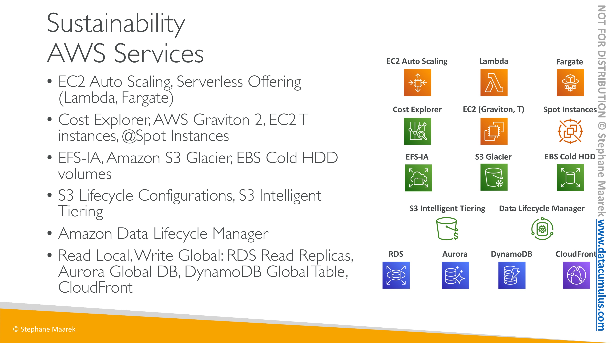

# AWS 공인 클라우드 전문가 CLF-C01 연습문제

#### 1. 회사는 인프라를 온프레미스 데이터 센터에서 AWS 클라우드로 이동할 계획입니다. 다음 중 회사가 AWS 클라우드에서 솔루션을 구축하는 데 적합한 AWS 서비스를 적용 할 수 있도록 어떤 옵션을 권장 하시겠습니까? (2개 선택)
- [x] <mark>**AWS Service Catalog**</mark>
- [ ] Amazon CloudWatch
- [ ] AWS CloudTrail
- [x] <mark>**AWS Partner Network**</mark>
- [ ] AWS Organizations
> AWS Service Catalog  
> - IT 관리자가 승인된 제품의 카탈로그를 생성 및 관리하고 최종 사용자에게 배포할 수 있습니다  
> - 정책을 중앙 관리해야 하는 조직, IT 팀, MSP(관리형 서비스 제공업체)를 위해 개발되었습니다.  

> Amazon CloudWatch  
> - AWS 클라우드 리소스와 AWS에서 실행되는 애플리케이션을 위한 모니터링 서비스  
> - 시스템 전반의 리소스 사용률, 애플리케이션 성능, 운영 상태를 파악할 수 있습니다.  

> AWS CloudTrail  
> - 사용자 활동 및 API 사용을 추적하여 감사, 보안 모니터링 및 운영 문제 해결을 지원합니다.  
> - 활동 감사, 보안 모니터링 또는 운영 문제 해결이 필요한 경우 CloudTrail을 사용합니다.  

> AWS Partner Network  
> - 고객을 위한 솔루션과 서비스를 구축하는 기술 및 컨설팅 비즈니스를 위한 글로벌 파트너 프로그램  

> AWS Organizations  
> - AWS의 워크로드가 확장됨에 따라 환경을 중앙에서 관리하는 데 도움이 됩니다.  

#### 2. AWS Auto Scaling은 수요 증감에 맞춰 인스턴스의 수만 증감한다.

#### 3. 다음 중 Amazon SQS 애플리케이션 시스템을 사용해야 하는 경우는 무엇입니까? (2개 선택)
- [ ] 이벤트 구독자에게 푸시 알림 제출하는 경우 - *Amazon SNS*
- [x] <mark>**더 나은 내결함성을 위해 시스템의 특정 부분을 분리해야 하는 경우**</mark>
- [ ] 워크플로우에서 특정 작업을 자동화해야 하는 경우 - *Amazon SWF*
- [ ] 애플리케이션에서 메시지 전달을 위해 업계 표준 메시징 프로토콜을 사용해야 하는 경우 - *Amazon MQ*
- [x] <mark>**애플리케이션 이벤트 또는 메시지에 대해 내구성 있는 스토리지가 필요한 경우**</mark>
> Amazon SQS
> - 마이크로 서비스, 분산 시스템 및 서버리스 애플리케이션을 쉽게 분리하고 확장할 수 있도록 지원하는 완전관리형 메시지 대기열 서비스

#### 4. 다음 중 비용 최적화를 위해 예약을 지원하는 AWS 서비스는 무엇입니까? (2개 선택)
- [ ] Lambda *사용량만큼 비용을 지불합니다.*
- [ ] S3 *사용량만큼 비용을 지불합니다.*
- [x] <mark>**RDS**</mark>
- [x] <mark>**EC2 instance**</mark>
- [ ] DocumentDB
> 예약 지원 서비스
> - EC2 예약 인스턴스
> - DynamoDB 예약 용량
> - ElastiCache 예약 노드
> - RDS RI
> - Redshift 예약 노드

#### 5. 월별 AWS 청구액을 추정하는 데 어떤 도구가 도움이 될 수 있습니까?
- [x] <mark>**AWS Pricing Calculator**</mark>
- [ ] AWS TCO Calculator *비용 절감 추정 시 사용*
- [ ] AWS IAM *계정 관리*
- [ ] AWS FREE Monthly Calculator *없는 서비스*
> AWS Pricing Calculator
> - 서비스별로 계획된 리소스를 입력할 수 있으며, 가격 계산기는 매달 예상 비용을 제공
> - 예상 사용량을 기준으로 사용 사례에 대한 AWS 서비스의 월별 비용을 추정

#### 6. 보안 감사 기관은 AWS 클라우드를 사용하며 AWS의 사전 승인 없이 자체 AWS 인프라에서 보안 평가를 수행하려고 합니다. 다음 중 이것을 설명하는 것은 무엇입니까?
- [ ] AWS Secret Manager *애플리케이션, 서비스 및 IT 리소스에 액세스하는 데 필요한 비밀을 보호*
- [ ] Amazon Inspector *EC2 인스턴스의 취약성을 확인하는 데 도움이 되는 자동화된 보안 평가 서비스*
- [x] <mark>**침투 테스트**</mark>
- [ ] 네트워크 스트레스 테스트

#### 7. 기존 서버에서 클라우드로 이동할 때 비용이 어떻게 이동합니까?
- [x] <mark>**자본 비용은 변동 비용으로 거래 됩니다**<mark>

#### 8. 회사에서 AWS 클라우드를 사용하고 개발 및 프로덕션 환경에 대한 별도의 AWS 비용 계산서를 받고 싶습니다. 다음 중 이 사용 사례에 권장하는 솔루션은 무엇입니까?
- [x] <mark>**개발 및 프로덕션 환경을 위한 별도의 AWS 계정을 생성하여 별도의 AWS 비용 계산서를 받는다**</mark>
- [ ] AWS Organizations를 사용하여 개발 및 프로덕션 환경을 위한 별도의 AWS 비용 계산서를 생성한다. *AWS Organizations는 결제를 중앙에서 관리*
- [ ] AWS Cost Explorer를 사용하여 개발 및 프로덕션 환경을 위한 별도의 AWS 비용 계산서를 생성한다. *별도의 송장을 생성할 수 없습니다.*
- [ ] AWS 계정의 모든 리소스를 개발 또는 프로덕션으로 태그 지정하고 별도의 AWS 비용 계산서를 생성한다. *태그를 기반으로 별도의 계산서를 생성할 수 없습니다.*

#### 9. 여러 AWS 계정에 대한 액세스를 쉽게 관리하고 사용자에게 단일 로그인 액세스를 제공 할 수 있는 AWS 서비스는 무엇입니까?
- [ ] Amazon SWF *Simple Workflow Service*
- [x] <mark>**AWS SSO(Single Sign-On)**</mark> *할당된 모든 계정 및 애플리케이션을 한 곳에서 액세스*
- [ ] Amazon SES *Simple email Servie*
- [ ] Amazon SQS *완전관리형 메시지 대기열 서비스*
> AWS SSO(Single Sign-On)
> - AWS Organizations의 모든 내 계정에 대한 액세스와 사용자 권한을 중앙에서 손쉽게 관리

#### 10. 분산 서비스 거부 (DDoS) 공격을 완화하는 데 사용할 수 있는 AWS 서비스는 무엇입니까?
- [ ] AWS Systems Manager *AWS 인프라에 대한 가시성과 제어를 제공*
- [x] <mark>**AWS Shield**</mark>
- [ ] Amazon CloudWatch *모니터링 및 관찰 기능 서비스*
- [ ] AWS KMS *손쉽게 암호화 키를 생성 및 관리하고 다양한 AWS 서비스와 애플리케이션에서의 사용을 제어*
> AWS Shield
> - 모든 AWS 고객은 추가 비용 없이 AWS Shield Standard에 의한 자동 보호
> - CloudFront 및 Amazon Route 53과 함께 사용하면, 모든 알려진 인프라(계층 3 및 4) 공격으로부터 가용성을 포괄적으로 보호
> - 가장 빈번히 발생하는 일반적인 네트워크 및 전송 계층 DDoS 공격에 대한 휴리스틱 기반의 상시 네트워크 플로우 모니터링 및 인라인 완화를 제공

#### 11. 다음 중 AWS CloudTrail에 대해 올바른 설명은 무엇입니까?
- [ ] 기본적으로 비활성화 *활성화*
- [x] <mark>**전체 리전 및 단일 리전에 적용할지를 정할 수 있음**</mark>
- [ ] EC2에서 애플리케이션 로유 로그 캡쳐 가능 *오류 로그 캡쳐하지 않음*
- [ ] 생성된 모든 관리 이벤트 추적에 대해 요금 부과 *첫번째 이후에 생성환 추가 관리만 청구*
> AWS CloudTrail
> - AWS ***계정***의 거버넌스, 규정 준수, 운영 감사, 위험 감사를 지원하는 서비스
> - AWS 인프라에서 ***계정 활동***과 관련된 작업을 기록하고 지속적으로 모니터링하며 보관
> - AWS 서비스를 통해 수행된 작업을 비롯하여 AWS ***계정 활동***의 이벤트 기록을 제공

#### 12. 회사가 IT 인프라를 온프레미스 데이터 센터에서 AWS 클라우드로 마이그레이션했습니다. 다음 중 회사가 부담하는 비용은 무엇입니까?
- [ ] AWS 데이터 센터 물리적 보안 비용
- [ ] AWS 클라우드의 하드웨어 인프라 비용
- [ ] AWS 클라우드에서 서버 전원을 공급하는 비용
- [x] <mark>**애플리케이션 소프트웨어 라이선스 비용**</mark>

#### 13. 데이터베이스 백업을 유지하기 위한 가장 저렴한 스토리지 옵션을 제공하는 서비스는 무엇입니까?
- [ ] Amazon S3 *객체 스토리지 서비스*
- [ ] <mark>**Amazon Glacier**</mark>
- [ ] Amazon EFS *완전관리형 NFS 파일 시스템*
- [ ] Amazon EBS *고성능 블록 스토리지 서비스*
> Amazon S3 Glacier
> - 데이터 보관 및 장기 백업을 위한 안전하고 안정적이며 비용이 매우 저렴한 Amazon S3 스토리지 클래스

#### 14. 다양한 사용 사례, 워크로드 또는 애플리케이션에 서비스를 사용할 수 있는 방법에 대한 일반적인 아키텍처 지침을 제공하는 AWS Support 플랜은 무엇입니까?
- [ ] Business
- [ ] Enterprise
- [x] <mark>**Developer**</mark>
- [ ] Basic

#### 15. 클라우드 실무자는 해당 리소스를 사용하는 애플리케이션에 영향을 미칠 수 있는 문제를 신속하게 식별하기 위해 리소스에 대한 운영 통찰력을 얻고자 합니다. 이 작업에 어떤 AWS 서비스가 도움이 될 수 있습니까?
- [ ] AWS Trusted Advisor *환경을 최적화하여 비용을 절감하고 성능을 높이며 보안을 개선하는 데 도움이 되는 온라인 리소스*
- [ ] Amazon Inspector *EC2 보안 및 규정 준수를 개선하는 데 도움이 되는 자동화 된 보안 평가 서비스*
- [ ] AWS Personal Health Dashboard *사용자에게 영향을 미칠 수 있는 이벤트가 발생할 때 알림 및 수정 지침을 제공*
- [x] <mark>**AWS Systems Manager**</mark>
> AWS Systems Manager
> - AWS 인프라에 대한 가시성과 제어를 제공
> - 리소스를 애플리케이션별로 그룹화하고, 모니터링과 문제 해결을 위해 운영 데이터를 보고, 리소스 그룹에 조치
> - 리소스 및 애플리케이션 관리를 간소화하고, 운영 문제를 탐지 및 해결하는 시간을 단축하며, 인프라를 대규모로 안전하게 운영 및 관리

#### 16. 다음 중 SQL 주입 및 교차 사이트 스크립팅과 같은 애플리케이션 계층 공격으로부터 웹 애플리케이션을 보호하는 서비스는 무엇입니까?
- [x] <mark>**AWS WAF**</mark>
- [ ] AWS Shield *AWS에서 실행되는 애플리케이션을 보호하는 디도스(DDoS) 보호 서비스*
- [ ] 보안 그룹 *인스턴스에 대한 인바운드 및 아웃바운드 트래픽을 제어하는 가상 방화벽*
- [ ] 네트워크 Access Control List *1개 이상의 서브넷 내부와 외부의 트래픽을 제어하기 위한 방화벽 역할을 하는 VPC를 위한 선택적 보안 계층*
> AWS WAF
> - 웹 애플리케이션 방화벽
> - 애플리케이션에 트래픽이 도달하는 방법을 제어
> - SQL 주입 또는 사이트 간 스크립팅 같은 일반적인 공격 패턴을 차단

#### 17. 회사에서는 Amazon S3에 익명의 환자 건강 데이터를 저장합니다. CTO는 S3의 모든 중요한 데이터가 검색되고 식별되는지 확인하려고 합니다. 다음 중 이 사용 사례를 해결하는 것이 권장되는 AWS 서비스는 무엇입니까?
- [ ] AWS Secrets Manager *액세스할 때 필요한 보안 정보를 보호*
- [ ] Amazon Polly *text to voice*
- [ ] AWS Glue *분석을 위해 데이터를 더욱 손쉽게 준비하고 로드*
- [x] <mark>**Amazon Macie**</mark>
> Amazon Macie
> - 완전관리형의 데이터 보안 및 데이터 프라이버시 서비스
> - 기계 학습 및 패턴 매칭을 활용하여 AWS에서 민감한 데이터를 검색하고 보호

#### 18. 계정 보안은 MFA활성화가 필수이며, 강력한 암호 정책이 필요하다.

#### 19. 리전을 선택하는 주요 요인은 low latency와 국가별 데이터 주권 준수 요구 사항이다.

#### 20. 다음 중 AWS 글로벌 인프라에 속하지 <mark>않는</mark> 것은 무엇입니까?
- [ ] 가용 영역 *AWS 리전의 중복 전력, 네트워킹 및 연결이 제공되는 하나 이상의 개별 데이터 센터*
- [ ] 엣지 로케이션
- [ ] 리전 *데이터 센터를 클러스터링하는 물리적 위치*
- [x] <mark>**배치 그룹**</mark> *낮은 네트워크 지연 시간, 높은 네트워크 처리량의 이점을 누리는 단일 가용 영역 내 인스턴스의 논리적 그룹*

#### 21. AWS의 가용성과 확장성이 뛰어난 클라우드 Domain Name System (DNS) 웹 서비스는 무엇입니까?
- [ ] Rekognition *딥 러닝 기술을 사용하여 애플리케이션에 이미지 및 비디오 분석*
- [x] <mark>**Route53**</mark>
- [ ] Lightsail *AWS를 시작할 수 있는 가장 쉬운 방법*
- [ ] Active Directory Domain Service
> Route53
> - 클라우드 Domain Name System (DNS) 웹 서비스
> - 사용자의 요청을 Amazon EC2 인스턴스, Elastic Load Balancing 로드 밸런서, Amazon S3 버킷 등 AWS에서 실행되는 인프라에 효과적으로 연결

#### 22. AWS의 태그 또는 리소스에 지정된 기준에 따라 정보를 구성하고 통합해야 합니다. 다음 중 어떤 것을 사용해야합니까?
- [ ] Amazon CloudWatch Dashboard *CloudWatch 콘솔의 사용자 지정 가능 홈페이지*
- [ ] AWS Directory Service
- [ ] AWS IAM 그룹 *IAM 그룹은 IAM 사용자들의 집합*
- [x] <mark>**AWS 리소스 그룹**</mark> *많은 리소스에 대한 태스크를 한 번에 관리하고 자동화할 수 있는 서비스*

#### 23. 다음 클라우드 모범 사례 중 SOA (서비스 지향 아키텍처) 설계 원칙의 사용을 강화하는 것은 무엇입니까?
- [x] <mark>**구성 요소 분리**</mark>
- [ ] 탄력성 구현 *필요에 따라 리소스를 획득하고 더 이상 필요하지 않을 때 리소스를 릴리스하는 기능*
- [ ] 실패를 위한 설계 *클라우드에서 아키텍처를 설계할 때 비관론자 역할을 권장*
- [ ] 병렬 구성

#### 24. Amazon CloudWatch 결제 지표 데이터는 어느 AWS 리전에 저장됩니까?
- [x] <mark>**결제 지표 데이터는 미국 동부(버지니아 북부) 리전에 저장되며 전 세계 요금을 반영**</mark>

#### 25. 다음 중 AWS Lambda에 대해 올바른 설명은 무엇입니까? (2개 선택)
- [ ] AWS에서 Docker 컨테이너 어플리케이션을 쉽게 실행, 확장 및 보호
- [x] <mark>**서버를 프로비저닝하거나 관리하지 않고도 코드를 실행**</mark>
- [ ] 코드를 통해 동작을 제어하기 위해 기본 운영 체제에 대한 엑세스 제공
- [ ] 기본 서버리스 운영 체제에 데이터베이스 설치 가능
- [x] <mark>**사용한 컴퓨팅 시간에 대해서만 비용 지불**</mark>

#### 26. 클라우드에서 가용성과 확장성이 뛰어난 웹 앱을 만드는 데 도움이 되는 서비스는 무엇입니까? (2개 선택)
- [x] <mark>**AWS Elastic Load Balancing(ELB)**</mark>
- [ ] Amazon CloudFront *고속 콘텐츠 전송 네트워크(CDN) 서비스*
- [ ] Amazon CloudWatch *모니터링 및 관찰 기능 서비스*
- [ ] Amazon AppStream 2.0 *완전관리형 비영구적인 애플리케이션 및 데스크톱 스트리밍 서비스*
- [x] <mark>**Amazon EC2 Auto Scaling**</mark>

#### 27. EC2 예약 인스턴스를 구매하는 가장 비용 효율적인 옵션은 무엇입니까? 
- [x] <mark>**3년 선결제 -> 3년 부분 선결제 -> .... -> 1년 부분 선결제 -> 1년 선결제 없음**</mark>

#### 28. 고객에게 더 나은 서비스를 제공하려면 로컬 서버를 업그레이드해야 합니다. 그러나 로컬에 저장된 데이터는 규정 준수 요구 사항으로 인해 마이그레이션 할 수 없습니다.이 시나리오에서는 어떤 모델을 채택해야 합니까?
- [x] <mark>**데이터를 로컬에 저장된 상태로 유지하면서 서버에 EC2 인스턴스를 사용할 하이브리드 환경을 설정**</mark>

#### 29. AWS에서 _______는 자체 하드웨어 모듈을 관리하지 않고도 암호화 작업에 사용되는 암호화 키를 쉽게 생성하고 제어할 수 있는 관리형 서비스입니다. _______에 들어갈 내용은 무엇입니까?
- [x] <mark>**AWS KMS**</mark>
- [ ] AWS System Manager *AWS 인프라에 대한 가시성과 제어를 제공*
- [ ] AWS CloudHSM *클라우드 기반 하드웨어 보안 모듈(HSM)*
- [ ] AWS IAM *AWS 서비스와 리소스에 대한 액세스를 안전하게 관리*

#### 30. 회사에서 Amazon EC2 비용을 최적화 하려고 합니다. 다음 중 이 작업에 도움이 될 수 있는 작업은 무엇입니까? (2개 선택)
- [x] <mark>**수요에 따라 인스턴스 수를 조정하도록 Auto Scaling 그룹 설정**</mark>
- [ ] 더 높은 AWS Support 플랜 선택
- [x] <mark>**EC2 예약 인스턴스 구매**</mark>
- [ ] EC2 인스턴스 수직 확장
- [ ] 자체 서버 구축

#### 31. 회사는 기본 인프라를 관리 할 필요성을 없애고 애플리케이션 배포 및 관리에 집중하려고 합니다. 이것은 어떤 유형의 클라우드 컴퓨팅을 의미합니까?
- [ ] On-premise *프라이빗 클라우드*
- [ ] Infrastructure as a Service(IaaS)
- [x] <mark>**Platform as a Service(Paas)**</mark>
- [ ] Software as a Service(SaaS)

#### 32. 다음 AWS 서비스 중 계정 전체에서 AWS WAF 규칙을 구성하는 보안 관리 도구를 제공하는 것은 무엇입니까?
- [x] <mark>**AWS Firewall Manager**</mark>
- [ ] AWS Trusted Advisor *AWS 모범 사례에 따라 리소스를 프로비저닝하는 데 도움이 되도록 실시간 지침을 제공하는 온라인 도구*
- [ ] AWS Resource Accesss Manager *AWS 계정 또는 AWS 조직 내에서 AWS 리소스를 쉽고 안전하게 공유 할 수있는 서비스*
- [ ] Amazon GuardDuty *AWS 계정, 워크로드 및 Amazon S3에 저장된 데이터를 보호하기 위해 악의적 활동 또는 무단 동작을 지속적으로 모니터링하는 위협 탐지 서비스*
> AWS Firewall Manager
> - AWS Organization의 여러 계정과 애플리케이션에서 방화벽 규칙을 중앙에서 구성 및 관리할 수 있는 보안 관리 서비스
> - 새로운 애플리케이션이 생성될 때 새로운 애플리케이션 및 리소스가 공통 보안 규칙 세트를 손쉽게 준수하도록 할 수 있습니다.

#### 33. 회사에서 영어 자막을 한국어 자막으로 변환하려고 합니다. 이 사례에 어떤 AWS 서비스를 추천 하시겠습니까?
- [ ] Amazon Rekognition *딥 러닝 기술을 사용하여 애플리케이션에 이미지 및 비디오 분석*
- [ ] Amazon Polly *text to voice*
- [ ] Amazon Transcribe *voice to text*
- [x] <mark>**Amazon Translate**</mark>

#### 34. 테스트 기간 후에 인스턴스 제품군, 운영 체제 및 테넌시를 변경하도록 예정된 베타 프로그램용 새 EC2 인스턴스를 시작해야 합니다. 어떤 유형의 예약 인스턴스 (RI)를 사용해야합니까?
- [ ] 예약된 RI *새로운 속성이 있는 다른 예약 인스턴스의 기간 동안 교환 할 수 없습니다.*
- [x] <mark>**컨버터블(전환형) RI**</mark>
- [ ] 영역 RI *가용 영역과 인스턴스 크기 유연성이 없습니다.*
- [ ] 표준 RI *교환 할 수 없으며 수정만 가능*

#### 35. 다음 중 S3 버킷에서 자주 액세스하지 않는 데이터를 보다 비용 효율적인 스토리지 클래스로 자동 전송하기 위해 사용해야 하는 것은 무엇입니까?
- [x] <mark>**수명 주기 정책**</mark>

#### 36. 확장성이 뛰어난 MySQL 데이터베이스를 시작해야 하는 경우 어떤 AWS 서비스를 사용해야 합니까?
- [ ] Amazon Redshift *속도가 빠른 완전관리형 클라우드 데이터 웨어하우스*
- [x] <mark>**Amazon Aurora**</mark>
- [ ] Amazon DynamoDB *키-값 및 문서 데이터베이스*
- [ ] Amazon ElastiCache *오픈 소스 호환 인 메모리 데이터 스토어*

#### 37. 다음 중 Amazon EC2 인스턴스가 DynamoDB 테이블에 액세스하는 데 사용해야 하는 요소는 무엇입니까?
- [ ] AWS Key Management Service *손쉽게 암호화 키를 생성 및 관리하고 다양한 AWS 서비스와 애플리케이션에서의 사용을 제어*
- [ ] Amazon Cognito *웹과 모바일 앱에 빠르고 손쉽게 사용자 가입, 로그인 및 액세스 제어 기능을 추가*
- [x] <mark>**IAM Role**</mark>
- [ ] IAM User Access Key *IAM 사용자 또는 AWS 계정 루트 사용자에 대한 장기 자격 증명*

#### 38. 회사가 비용 최적화를 추진하고 있으며 활용도가 낮은 모든 EC2 인스턴스를 식별하려고 합니다. 이 사용 사례를 해결하기 위해 어떤 AWS 서비스를 사용할 수 있습니까?
- [x] <mark>**AWS Trusted Advisor**</mark>
- [ ] AWS 비용 및 사용 보고서 *사용 가능한 가장 포괄적인 비용 및 사용 데이터 세트가 포함*
- [ ] Amazon CloudWatch *예상 요금을 모니터링하는 경보를 생성*
- [ ] AWS Cost Explorer *시간 경과에 따른 AWS 비용 및 사용량을 시각화, 이해 및 관리 할 수 있는 사용하기 쉬운 인터페이스*

#### 39. 회사의 DevOps 팀은 마이크로 서비스 아키텍처를 사용하여 구축된 서버리스 애플리케이션의 성능 문제를 디버깅하려고 합니다. 다음 중 이 사용 사례를 해결하는 것이 권장되는 AWS 서비스는 무엇입니까?
- [ ] AWS Trust Advisor *AWS 모범 사례에 따라 리소스를 프로비저닝하는 데 도움이 되도록 실시간 지침을 제공하는 온라인 도구*
- [ ] Amazon Pinpoint *아웃바운드/인바운드 마케팅 커뮤니케이션 서비스*
- [x] <mark>**AWS X-Ray**</mark>
- [ ] AWS CloudFormation *클라우드 환경에서 AWS 및 타사 애플리케이션 리소스를 모델링하고 프로비저닝할 수 있도록 공용 언어를 제공*

#### 40. 클라우드 컴퓨팅의 장점은 무엇입니까?
- [x] <mark>**민첩성**</mark>
- [x] <mark>**탄력성**</mark>
- [x] <mark>**비용 절감**</mark>
- [x] <mark>**빠른 글로벌 배포**</mark>

#### 41. 실시간 데이터 스트리밍에 일반적으로 사용되는 AWS 서비스는 무엇입니까?
- [ ] Amazon EMR *클라우드 빅 데이터 플랫폼*
- [ ] Amazon Elasticsearch *Elasticsearch를 배포, 보호, 실행이 가능한 완전관리형 서비스*
- [x] <mark>**Amazon Kinesis**</mark>
- [ ] Amazon Data Pipeline *온프레미스 데이터 소스뿐 아니라 여러 AWS 컴퓨팅 및 스토리지 서비스 간에 데이터를 안정적으로 처리하고 지정된 간격으로 이동할 수 있게 지원하는 웹 서비스*
> Amazon Kinesis
> - 실시간 스트리밍 데이터를 손쉽게 수집, 처리 및 분석할 수 있으므로 적시에 통찰력을 확보하고 새로운 정보에 신속하게 대응 가능
> - 완전관리형으로 스트리밍 애플리케이션을 운영하므로 사용자는 인프라를 관리할 필요 없음

#### 42. 회사에서는 Docker 컨테이너에서 독점 애플리케이션을 실행합니다. 컨테이너를 실행하고 기본 서버에 계속 액세스 할 수 있도록 어떤 AWS 서비스를 추천 하시겠습니까?
- [ ] Amazon Elastic Container Registry(ECR) *Docker 컨테이너 이미지를 저장, 관리 및 배포*
- [ ] AWS Fargate *컨테이너를 위한 서버리스 컴퓨팅 엔진*
- [x] <mark>**Amazon Elastic Container Service(ECS)**</mark>
- [ ] AWS Lambda *서버를 프로비저닝하거나 관리하지 않고도 코드를 실행할 수 있는 컴퓨팅 서비스*
> Amazon Elastic Container Service(ECS)
> - 완전관리형 컨테이너 오케스트레이션 서비스
> - 서버리스 컴퓨팅인 AWS Fargate를 사용하여 ECS 클러스터를 실행

#### 43. 다음 중 VPC 네트워크를 보호하는 데 사용되는 AWS 서비스는 무엇입니까? (2개 선택)
- [x] <mark>**Network ACL**</mark>
- [ ] Application Load Balancer *로드 밸런싱, 고급 요청 라우팅 기능*
- [x] <mark>**Security Group**</mark>
- [ ] AWS IAM *AWS 서비스와 리소스에 대한 액세스 관리*
- [ ] Amazon CloudFront *고속 콘텐츠 전송 네트워크(CDN) 서비스*
> Network ACL
> - 1개 이상의 서브넷 내부와 외부의 트래픽을 제어하기 위한 방화벽 역할을 하는 VPC를 위한 선택적 보안 계층

> Security Group
> - 인스턴스에 대한 인바운드 및 아웃바운드 트래픽을 제어하는 가상 방화벽 역할

#### 44. 회사는 스토리지 클래스간에 비용 효율적으로 객체를 관리하기 위한 규칙 세트를 정의하려고 합니다. 다음 중 어떤 Amazon S3 기능을 사용 하시겠습니까?
- [ ] S3 교차 리전 복제 *교차 리전 복제 (CRR)는 다른 AWS 리전의 Amazon S3 버킷간에 객체를 복사*
- [x] <mark>**S3 수명 주기 관리**</mark>
- [ ] S3 버킷 정책 *리소스 기반 AWS Identity and Access Management (IAM) 정책*
- [ ] S3 Transfer Acceleration *장거리 파일을 빠르고 쉽고 안전하게 전송*

#### 45. 다음 중 AWS 클라우드에서 단기적이고 급증하며 중요한 워크로드를 위한 가장 비용 효율적인 EC2 인스턴스 구매 옵션은 무엇입니까?
- [ ] 예약 인스턴스 *온디맨드 인스턴스 요금에 비해 Amazon EC2 비용을 대폭 절감 (최대 75%)*
- [x] <mark>**온디멘드 인스턴스**</mark> *실행하는 인스턴스에 따라 시간당 또는 초당 컴퓨팅 파워에 대한 비용을 지불*
- [ ] 전용 호스트 *Amazon EC2에서 Microsoft 및 Oracle과 같은 공급 업체의 적격 소프트웨어 라이선스를 사용*
- [ ] 스팟 인스턴스 * 온디맨드 가격보다 저렴한 가격으로 제공되는 미사용 EC2 인스턴스*

#### 46. 다음 중 AWS VPC 서비스와 관련하여 올바른 설명은 무엇입니까? (2개 선택)
- [ ] NACL have Only allow rule
- [x] <mark>**SG have Only allow rule**</mark>
- [ ] NAT instance manage AWS *NAT 게이트웨이는 AWS에서 관리하지만 NAT 인스턴스는 사용자가 관리합니다.*
- [x] <mark>**NAT Gatewat manage AWS**</mark>
- [ ] SG have allow rule and deny rule

#### 47. 서버리스 컴퓨팅으로 전환 할 때 얻을 수 있는 주요 이점은 무엇입니까?
- [x] <mark>**관리에 대한 오버헤드가 없으므로 어플리케이션에 집중 가능**</mark>
- [ ] 서비스 업체가 보안을 완벽하게 관리
- [ ] 가용성이 높아 다운타임에 대한 걱정이 없음
- [ ] 전반적으로 비용이 저렴

#### 48. 웹 사이트의 웹 서버와 같은 단일 리소스로 트래픽을 라우팅하는 데 사용할 AWS Route 53 라우팅 정책은 무엇입니까?
- [x] <mark>**단순 라우팅 정책**</mark>
- [ ] 지연 시간 라우팅 정책
- [ ] 가중치 기반 라우팅 정책
- [ ] 장애 조치 라우팅 정책
> 라우팅 정책
> - 단순 라우팅 정책 – 도메인에 대해 특정 기능을 수행하는 하나의 리소스만 있는 경우(예: example.com 웹 사이트의 콘텐츠를 제공하는 하나의 웹 서버)에 사용합니다.
> - 장애 조치 라우팅 정책 – 액티브-패시브 장애 조치를 구성하려는 경우에 사용합니다. 
> - 지리 위치 라우팅 정책 – 사용자의 위치에 기반하여 트래픽 라우팅하려는 경우에 사용합니다.
> - 지리 근접 라우팅 정책 – 리소스의 위치를 기반으로 트래픽을 라우팅하고 필요에 따라 한 위치의 리소스에서 다른 위치의 리소스로 트래픽을 보내려는 경우에 사용합니다.
> - 지연 시간 라우팅 정책 – 여러 AWS 리전에 리소스가 있고 최상의 지연 시간을 제공하는 리전으로 트래픽을 라우팅하려는 경우에 사용합니다.
> - 다중 응답 라우팅 정책 – Route 53이 DNS 쿼리에 무작위로 선택된 최대 8개의 정상 레코드로 응답하게 하려는 경우에 사용합니다.
> - 가중치 기반 라우팅 정책 – 사용자가 지정하는 비율에 따라 여러 리소스로 트래픽을 라우팅하려는 경우에 사용합니다.

#### 49. ID 및 액세스 관리 (IAM) 사용자의 보안을 개선하기 위해 구현할 수 있는 것은 무엇입니까?
- [x] <mark>**MFA 활성화 및 강력한 암호 정책**</mark>

#### 50. 회사는 과거 데이터를 저장하는 내구성 있고 비용 효율적인 방법을 찾고 있습니다. 규정 준수 요구 사항으로 인해 데이터는 10년 동안 저장해야 합니다. 어떤 AWS 스토리지 솔루션을 제안 하시겠습니까?
- [ ] Amazon EFS *완전관리형 NFS 파일 시스템*
- [ ] S3 Glacier
- [ ] AWS Storage Gateway *클라우드 스토리지에 대한 온프레미스 액세스 권한을 제공하는 하이브리드 클라우드 스토리지 서비스*
- [x] <mark>**S3 Glacier Deep Archive**</mark> *규제 규정 준수 요건을 충족하기 위해 7-10년 이상 데이터 세트를 보관하는 고객(특히 금융 서비스, 의료, 공공 부문과 같이 엄격하게 규제되는 산업의 고객)을 위해 설계*

#### 51. 다음 AWS 서비스 중 AWS 클라우드에서 리소스 보안을 구현하는데 필수적인 것은 무엇입니까?
- [x] <mark>**AWS IAM**</mark>
- [ ] Amazon CloudWatch *AWS 클라우드 리소스와 AWS에서 실행되는 애플리케이션을 위한 모니터링 서비스*
- [ ] AWS Shield *AWS에서 실행되는 애플리케이션을 보호하는 디도스(DDoS) 보호 서비스*
- [ ] AWS WAF *웹 애플리케이션 방화벽*

#### 52. 회사는 여러 부서에 예약된 EC2 인스턴스를 사용하며 각 부서는 고유한 AWS 계정을 가집니다. 그러나 일부 부서는 예약된 인스턴스를 충분히 활용하지 못하는 반면 다른 부서에는 더 많은 예약된 인스턴스가 필요합니다. 다음 중 가장 비용 효율적인 솔루션으로 추천할 만한 것은 무엇입니까?
- [x] <mark>**AWS Organizations를 사용하여 모든 부서의 AWS계정을 관리한다음 예약 EC2 인스턴스 공유**</mark>
> AWS Organizations 통합 결제 장점
> - 하나의 청구서 – 여러 계정에 대해 하나의 청구서를 받습니다.
> - 추적 용이 – 여러 계정에 걸쳐 요금을 추적하고 비용 및 사용량 데이터 합계를 다운로드할 수 있습니다.
> - 사용량 통합 – 조직 내 모든 계정에 걸쳐 사용량을 통합하여 대량 구매 요금 할인, 예약 인스턴스 할인 및 Savings Plans를 받을 수 있습니다. 이를 통해 프로젝트, 부서 또는 회사에 청구되는 요금이 개별 계정 요금보다 낮아집니다.
> - 추가 비용 없음 – 통합 결제는 추가 비용 없이 제공됩니다.

#### 53. 배포 단계 (개발, 스테이징, 프로덕션)에 따라 EC2 인스턴스에 레이블을 지정하고 정렬할 수 있는 기능은 무엇입니까?
- [ ] 인스턴스 사용자 데이터 *인스턴스를 시작할 때마다 초기화할 경우 준비하는 사용자 지정 스크립트*
- [x] <mark>**인스턴스 태그**</mark> *AWS 리소스에 할당되는 레이블*
- [ ] 인스턴스 메타 데이터 *실행 중인 인스턴스를 구성 또는 관리하는 데 사용*
- [ ] 인스턴스 유형

#### 54. 다음 중 AWS 데이터베이스 서비스는 무엇입니까?
- [ ] Database Migration Service *데이터베이스를 AWS로 빠르고 안전하게 마이그레이션할 수 있도록 지원*
- [ ] Redshift
- [ ] Glue *분석을 위해 데이터를 더욱 손쉽게 준비하고 로드할 수 있도록 하는 종합 관리형 추출, 변환, 로드(ETL) 서비스*
- [ ] Storage Gateway *클라우드 스토리지에 대한 온프레미스 액세스 권한을 제공하는 하이브리드 클라우드 스토리지 서비스*
> Redshift
> - 속도가 빠른 완전관리형 클라우드 데이터 웨어하우스
> - 모든 데이터를 표준 SQL 및 기존 BI(비즈니스 인텔리전스) 도구를 사용하여 간편하고 비용 효율적으로 분석

#### 55. 다음 중 AWS에서 통합 결제를 사용할 때의 이점은 무엇입니까? (2개 선택)
- [ ] 매달 일정금애긍로 모든 청구서 통합
- [ ] 하나의 멤버 계정으로 모든 마스터 계정 요금 지불
- [x] <mark>**조직의 모든 계정에서 사용량 결합하여 볼륨 요금과 예약 인스턴스 할인 공유**</mark>
- [x] <mark>**여러 계정에 대해 하나의 청구서**</mark>
- [ ] AWS계정과 AWS 협력사의 청구 및 결제 통합

#### 56. 다음 중 온프레미스 시스템에서 직접 사용할 수 있는 AWS 스토리지 서비스는 무엇입니까?
- [x] <mark>**Amazon Elastic File System**</mark>
- [ ] Amazon EC2 Instance Store *인스턴스 스토어는 Amazon EC2 인스턴스에 대한 임시 블록 수준 스토리지*
- [ ] Amazon Elastic Block Store
- [ ] Amazon Simple Storage Service
> 온프레미스 데이터 센터의 서버와 Amazon VPC의 Amazon EC2 인스턴스에서 Amazon EFS 파일 시스템에 액세스할 수 있습니다.  
> Amazon EFS에서는 파일 시스템에 액세스하는 모든 EC2 인스턴스와 온프레미스 서버 전체에 강력한 데이터 일관성, 파일 잠금 등 동일한 파일 시스템 액세스 의미 체계를 제공합니다.  
> 온프레미스에서 EFS 파일 시스템에 액세스하려면 온프레미스 데이터 센터와 Amazon VPC 간에 AWS Direct Connect 또는 AWS VPN 연결을 구성해야 합니다.

#### 57. 다음 중 독립 소프트웨어 공급 업체 (ISV), SaaS, PaaS, 개발자 도구, 관리 및 보안 공급 업체를 포함 할 수 있는 AWS 플랫폼에서 호스팅되거나 통합된 소프트웨어 솔루션을 제공하는 것은 무엇입니까?
- [ ] APN 컨설팅 파트너 *새로운 애플리케이션을 설계, 마이그레이션 또는 구축하도록 지원*
- [ ] 컨시어지 지원 *청구 및 계정 전문가로 구성된 팀으로 기업 계정 관련 업무를 전문적으로 담당*
- [ ] Technical Account Management *AWS Enterprise Support의 일부*
- [x] <mark>**APN 기술 파트너**</mark> *AWS 플랫폼에서 호스팅되거나 통합되는 소프트웨어 솔루션을 제공*

#### 58. 다음 중 클라우드에서 워크로드를 설계하고 실행하기 위한 주요 개념, 설계 원칙 및 아키텍처 모범 사례를 제공하는 것은 무엇입니까?
- [ ] AWS Marketplace *온라인 소프트웨어 스토어*
- [x] <mark>**AWS Well-Architected Framework**</mark>
- [ ] Share Responsible Model *기본 리소스를 포함하여 AWS 서비스를 관리, 유지 및 보호하는 데있어 AWS와 고객의 특정 책임을 설명*
- [ ] AWS 참조 아키텍처 다이어그램 *기술 리소스 모음*
> AWS Well-Architected
> - 애플리케이션 및 워크로드에 사용할 보안, 성능, 복원력 및 효율성이 뛰어난 인프라를 구축하는 클라우드 아키텍트를 돕기 위해 개발
> - 운영 우수성, 보안, 안정성, 성능 효율성 및 비용 최적화 등 다섯 가지 원칙 기반
> > 1. 운영 우수성 원칙  
> > 운영 우수성 원칙은 비즈니스 가치를 제공하고 지속적으로 프로세스와 절차를 개선하기 위해 시스템을 실행 및 모니터링하는 데 중점을 둡니다. 주로 변경 자동화, 이벤트 응답 및 일상적인 작업을 관리하기 위한 표준의 정의와 같은 내용을 주로 다룹니다.
> > 2. 보안 원칙  
> > 보안 원칙은 정보와 시스템을 보호하는 데 중점을 둡니다. 데이터의 기밀성 및 무결성, 권한 관리를 통한 사용자 작업 식별 및 관리, 시스템 보호와 보안 이벤트 탐지를 위한 제어 설정 같은 항목을 주로 다룹니다.
> > 3. 안정성 원칙   
> > 안정성 원칙은 워크로드가 의도하는 기능을 원하는 시점에 올바르고 일관적으로 수행하도록 하는 데 중점을 둡니다. 회복력 있는 워크로드는 장애에서 빠르게 회복되고 비즈니스와 고객의 요구 사항을 충족합니다. 분산 시스템 설계, 복구 계획, 변경 처리 방법 등의 항목을 주로 다룹니다.
> > 4. 성능 효율성 원칙  
> > 성능 효율성 원칙은 IT 및 컴퓨팅 리소스를 효율적으로 사용하는 데 중점을 둡니다. 워크로드 요구 사항에 적합한 리소스 유형 및 크기 선택, 성능 모니터링과 정보에 입각한 의사 결정을 통해 비즈니스 요구 사항의 변화에 맞춰 효율성을 유지하는 방법 같은 항목을 주로 다룹니다.
> > 5. 비용 최적화 원칙  
> > 비용 최적화 원칙은 불필요한 비용 발생을 피하는 데 중점을 둡니다. 지출 영역 파악 및 통제, 가장 적절하고 적합한 수의 리소스 유형 선택, 시간대별 지출 분석과 초과 지출 없이 비즈니스 요구 사항에 맞춘 조정 같은 항목을 주로 다룹니다.

#### 59. 다음 중 AWS 웹 애플리케이션 방화벽 (WAF)의 이점은 무엇입니까? (2개 선택)
- [ ] 알려진 모든 인프라 공격에 대한 보호 제공
- [x] <mark>**악성일 가능성이 있는 SQL 코드 존재 확인**</mark>
- [ ] Route53으로 전달되는 http/https 요청 모니터링
- [ ] DDOS 대응팀의 전담 지원
- [x] <mark>**지정한 요청을 제외한 모든 요청 차단**</mark>

#### 60. 고객은 직관적인 웹 기반 사용자 인터페이스를 통해 광범위한 AWS 서비스 컬렉션에 액세스해야 합니다. 다음 중 권장하는 옵션은 무엇입니까?
- [x] <mark>**AWS Management Console**</mark> *Amazon Web Services를 관리하기 위해 광범위한 서비스 콘솔 모음을 구성하고 참조하는 웹 애플리케이션*
- [ ] AWS SDK *개발 언어를 사용하여 AWS 서비스에 액세스하고 관리하는 데 사용*
- [ ] Bastion Host *인터넷과 같은 외부 네트워크에서 프라이빗 네트워크에 대한 액세스를 제공하는 서버*
- [ ] AWS CLI *명령줄에서 AWS 서비스에 액세스하고 스크립트를 통해 작업을 자동화하는 단순한 도구*

#### 61. 다음 중 AWS Organizations에서 AWS 계정을 제거하는 것과 관련하여 올바른 것은 무엇입니까?
- [ ] AWS Systems Manager에서 제거 가능 *AWS에서 인프라를 확인하고 제어*
- [x] <mark>**독립 실행형 계정으로 작동할 수 있어야 함. 그래야 제거 가능**</mark>
- [ ] SCP가 연결되어 있지 않아야 함. 그래야 제거 가능 *AWS 계정을 제거하기 위한 사전 요구 사항은 아닙니다.*
- [ ] AWS Support에 지원 티켓 제출해야 함

=========================================
- [ ] 보기1
- [ ] 보기1
- [ ] 보기1
- [ ] 보기1
- [ ] 보기1

