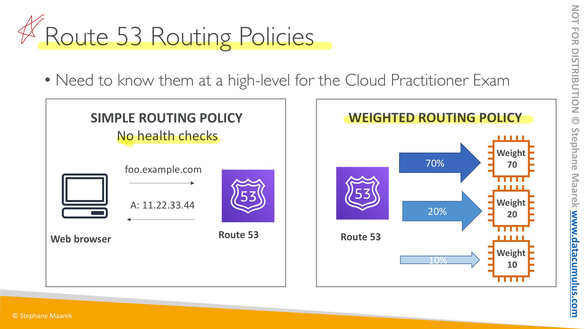
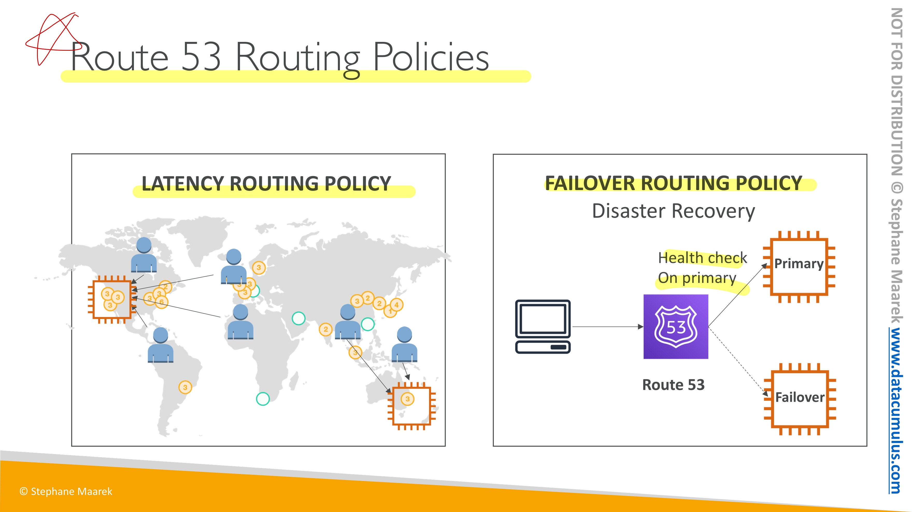

# AWS 공인 클라우드 전문가 CLF-C01 연습문제

#### 1. 사용자 수가 급증해서 웹 사이트의 응답 시간이 초과하고 있습니다. 이 웹사이트는 ELB 뒤에 있는 EC2 인스턴스의 Auto Scaling 그룹에서 실행 중입니다. 장애를 확인을 해보니 Auto Scaling 그룹이 그룹에 새 인스턴스 추가를 중지했습니다. 다음 Trusted Advisor 카테고리 중 이 문제에 대한 더 많은 통찰력을 제공하는 것은 무엇입니까? (2개 선택)
- [x] <mark>**서비스한도**</mark>
- [x] <mark>**성능**</mark>
- [ ] 보안
- [ ] 비용최적화
- [ ] 내결함성
> Trusted Advisor는 AWS 인프라를 최적화하고 보안과 성능을 향상시키고 전체 비용을 절감하며 서비스 한도를 모니터링할 수 있습니다. 
> - 비용 최적화 : AWS Trusted Advisor는 미사용 및 유휴 리소스를 제거하거나 예약 용량을 약정하여 AWS에서 비용을 절감할 수 있습니다.
> - 성능 : AWS Trusted Advisor는 서비스 한도를 점검하고 프로비저닝된 처리량을 활용하는지 확인하며 과다 사용되는 인스턴스를 모니터링함으로써 서비스 성능을 개선할 수 있습니다.
> - 보안 : AWS Trusted Advisor는 결함을 없애고 다양한 AWS 보안 기능을 사용하며 권한을 점검하여 애플리케이션 보안을 개선할 수 있습니다.
> - 내결함성 : AWS Trusted Advisor는 Auto Scaling, 상태 확인, 다중 AZ 및 백업 기능을 활용하여 AWS 애플리케이션의 가용성과 중복성을 향상시킬 수 있습니다.
> - 서비스 한도 : AWS Trusted Advisor는 서비스 사용량이 서비스 한도의 80%를 넘는지 점검합니다. 값은 스냅샷을 기반으로 하므로 현재 사용량은 다를 수 있습니다. 한도 및 사용량에 변경 사항이 반영되는 데 최대 24시간이 걸릴 수 있습니다.

#### 2. TAM (기술 지원 관리자)에 대한 액세스를 제공하는 AWS Support 플랜은 무엇입니까?
- [x] <mark>**Enterprise**</mark>

#### 3. 회사는 각 부서에 대해 여러 AWS 계정을 가지고 있습니다. 다음 AWS 서비스 중 이러한 AWS 계정에 대한 통합 결제 및 단일 결제 방법을 설정하는데 사용할 수 있는 것은 무엇입니까?
- [x] <mark>**AWS Organizations**</mark>
- [ ] AWS Secrets Manager *애플리케이션, 서비스, IT 리소스에 액세스할 때 필요한 보안 정보를 보호*
- [ ] AWS 예산 *비용 또는 사용량이 예산 금액을 초과하거나 초과할 것으로 예상될 때 알림을 받도록 사용자 지정 예산을 설정*
- [ ] AWS Cost Explorer *AWS 비용과 사용량을 시각화, 이해 및 관리할 수 있는 손쉬운 인터페이스를 제공*
> AWS Organizations를 활용하면 결제를 관리하고, 액세스, 규정 준수 및 보안을 제어하고, AWS 계정에서 리소스를 공유하는 일을 모두 중앙에서 손쉽게 처리 할 수 있습니다.

#### 4. AWS 리소스를 시작할 수 있는 AWS 클라우드의 논리적으로 격리된 섹션을 프로비저닝할 수 있는 AWS 서비스는 무엇입니까?
- [x] <mark>**Amazon VPC**</mark>
- [ ] Internet Gateway *수평 확장되고 가용성이 높은 중복 VPC 구성 요소*
- [ ] AWS Elastic Beanstalk *웹 애플리케이션 및 서비스를 간편하게 배포하고 조정할 수 있는 서비스*
- [ ] Amazon EC2 *안전하고 크기 조정이 가능한 컴퓨팅 파워를 클라우드에서 제공하는 웹 서비스*

#### 5. 다음 Support 플랜 중 AWS Personal Health Dashboard에 대한 액세스를 제공하는 것은 무엇입니까?
- [x] <mark>**Basic, Developer, Business, Enterprise** </mark>
> AWS Personal Health Dashboard는 모든 Support 플랜을 지원합니다.

#### 6. 회사는 대규모 민감한 데이터를 식별하고 보호하는 데 어려움을 겪고 있습니다. 이 작업을 지원할 수 있는 AWS 완전 관리형 서비스는 무엇입니까?
- [x] <mark>**Amazon Macie**</mark>
- [ ] AWS KMS *손쉽게 암호화 키를 생성 및 관리하고 다양한 AWS 서비스와 애플리케이션에서의 사용을 제어*
- [ ] AWS Secrets Manager *애플리케이션, 서비스, IT 리소스에 액세스할 때 필요한 보안 정보를 보호*
- [ ] AWS Artifact *자신에게 해당되는 규정 준수와 관련된 정보를 제공하는 신뢰할 수 있는 중앙 리소스*
> Amazon Macie는 완전관리형의 데이터 보안 및 데이터 프라이버시 서비스로서, 기계 학습 및 패턴 매칭을 활용하여 AWS에서 민감한 데이터를 검색하고 보호합니다.  
> Amazon Macie는 기계 학습 및 패턴 매칭을 사용하여 민감한 데이터를 대규모 및 비용 효율적으로 검색합니다.   
> Amazon Macie는 이름, 주소 및 신용 카드 번호와 같은 개인 식별 정보(PII)를 비롯하여 점점 증가하는 민감한 데이터 유형을 대규모로 자동 감지합니다.

#### 7. 다음 중 AWS에서 코드로서의 인프라 템플릿을 생성하고 배포 할 수 있는 것은 무엇입니까?
- [x] <mark>**AWS CloudFormation**</mark>
- [ ] Systems Manager *AWS 인프라에 대한 가시성과 제어를 제공*
- [ ] AWS Elastic Beanstalk *웹 애플리케이션 및 서비스를 간편하게 배포하고 조정할 수 있는 서비스*
- [ ] Lightsail *프로젝트를 신속하게 시작하는 데 필요한 모든 것을 포함*
> AWS CloudFormation은 Amazon Web Services 리소스를 모델링하고 설정하여 리소스 관리 시간을 줄이고 AWS에서 실행되는 애플리케이션에 더 많은 시간을 사용하도록 해 주는 서비스입니다.  
> - 인프라 관리 간소화  
> - 신속하게 인프라 복제  
> - 인프라 변경 사항을 쉽게 제어 및 추적

#### 8. 다음 중 AWS가 IT 리소스를 프로비저닝하는 시간을 줄이는 방법에 대해 옳은 것은 무엇입니까?
- [x] <mark>**IT리소스를 프로그래밍 방식으로 프로비저닝하는 다양한 방법을 제공**</mark>

#### 9. 하이브리드 클라우드를 사용하는 회사는 재해 복구를 위해 온프레미스 데이터의 보조 백업 사본을 저장하려고 합니다. 어떤 S3 스토리지 클래스를 사용 하시겠습니까?
- [x] <mark>**One Zone - Infrequent Access**</mark>
- [ ] Glacier
- [ ] Standard - Infrequent Access
- [ ] Standard
> S3 One Zone-IA는 자주 액세스하지 않지만 필요할 때 빠르게 액세스해야 하는 데이터에 적합합니다.

#### 10. 인프라를 다른 AWS 리전으로 쉽고 안전하게 복사하려면 어떻게 해야 합니까?
- [x] <mark>**CloudFormation 템플릿을 생성하고 새 리전에 배포**</mark>
- [ ] 골든 AMI 사용 *골든 AMI 생성은 EC2 인스턴스의 복사본만 생성하므로 다른 리전에 전송해야서 별도의 작업을 수행해야 합니다.*
- [ ] RDS 다중 AZ 활성화 *다중 AZ RDS를 활성화하면 다른 리전에 인프라 복사본이 생성되지 않습니다.*
- [ ] EBS 스냅샷 생성 수 복제 *EBS 스냅샷은 전체 인프라가 아닌 EC2 데이터만 포함합니다.*

#### 11. AWS Well-Architected Framework에 따르면 다음 중 보안 원칙에서 권장되는 조치는 무엇입니까?
- [x] <mark>**AWS KMS를 사용하여 데이터 암호화**</mark>
- [ ] AWS CloudFormation을 사용하여 보안 모범 사례 자동화 *보안 모범 사례를 자동화하는 데 사용되지 않습니다. 보안 모범 사례를 자동화하려면 Amazon Inspector를 사용해야 합니다.*
- [ ] AWS Cost Explorer를 사용하여 사용량 추적 *비용 최적화 원칙과 더 관련이 있습니다.*
- [ ] Amazon CloudWatch를 사용하여 전반적인 효율성 측정 *안정성 원칙과 더 관련이 있습니다.*
> AWS Well-Architected는 애플리케이션 및 워크로드에 사용할 보안, 성능, 복원력 및 효율성이 뛰어난 인프라를 구축하는 클라우드 아키텍트를 돕기 위해 개발되었습니다.  
> **보안 원칙**은 정보와 시스템을 보호하는 데 중점을 둡니다. 데이터의 기밀성 및 무결성, 권한 관리를 통한 사용자 작업 식별 및 관리, 시스템 보호와 보안 이벤트 탐지를 위한 제어 설정 같은 항목을 주로 다룹니다.   
> AWS Key Management Service (AWS KMS)를 사용하면 암호화에 사용되는 키를 쉽게 생성하고 제어 할 수 있습니다. 보안의 핵심 서비스입니다.

#### 12. 다음 중 Amazon CloudFront에서 지원하는 유효한 사용 사례는 무엇입니까? (2 개 선택)
- [x] <mark>**정적 자산 캐싱**</mark>
- [x] <mark>**라이브 및 주문형 비디오 스트리밍**</mark>
- [ ] 서버리스 대화형 쿼리
- [ ] 자동화 된 백업
- [ ] 스키마 변환
>Amazon CloudFront는 개발자 친화적 환경에서 짧은 지연 시간과 빠른 전송 속도로 데이터, 동영상, 애플리케이션 및 API를 전 세계 고객에게 안전하게 전송하는 고속 콘텐츠 전송 네트워크(CDN) 서비스입니다.  
>CloudFront는 AWS와 통합되며, AWS 글로벌 인프라와 직접 연결된 물리적 위치뿐만 아니라 다른 AWS Services와도 통합됩니다.   
>CloudFront 간에 전송된 데이터에 대해서는 비용을 지불하지 않습니다.  
>Amazon CloudFront는 전 세계의 최종 사용자에게 **정적 콘텐츠(예: 이미지, 스타일 시트, JavaScript 등)를 전송**합니다.    
>Amazon CloudFront CDN은 글로벌 최종 사용자에게 4K 화면을 전송하는 데 필요한 일관되게 높은 처리량으로 미디어(사전에 녹화된 파일과 라이브 이벤트 모두)를 **스트리밍하는 다양한 옵션을 제공**합니다.

#### 13. AWS의 어떤 서비스가 사전 예방적 방식으로 일반적인 DDoS 공격으로부터 리소스를 보호합니까?
- [x] <mark>**AWS Shield**</mark>
- [ ] AWS WAF *SQL 주입 또는 사이트 간 스크립팅과 같은 일반적인 공격 패턴을 차단하는 보안 규칙 및 사용자가 정의한 특정 트래픽 패턴을 필터링하는 규칙을 생성하도록 지원하여 애플리케이션에 트래픽이 도달하는 방법을 제어*
- [ ] 보안 그룹 *인바운드 및 아웃바운드 트래픽을 제어하는 가상 방화벽 역할*
- [ ] Amazon Inspector *AWS에 배포된 애플리케이션의 보안 및 규정 준수를 개선하는데 도움이 되는 자동 보안 평가 서비스*
>AWS Shield는 AWS에서 실행되는 애플리케이션을 보호하는 **디도스(DDoS) 보호 서비스**입니다.  
>모든 AWS 고객은 추가 비용 없이 AWS Shield Standard에 의한 자동 보호를 받을 수 있습니다.

#### 14. 다음 중 AWS에서 시스템을 설계 할 때 표준 설계 원칙이 **아닌** 것은 무엇입니까?
- [x] <mark>**서비스가 아닌 버서**</mark>
- [ ] 느슨한 결합
- [ ] 실패를 위한 설계
- [ ] 고정 서버 대신 일회용 리소스
>클라우드에서 애플리케이션을 구축하는 데 도움이 될 수 있는 다양한 모범 사례가 있습니다. 주목할 점은 다음과 같습니다.
>>1. 실패를 위한 설계
>>2. 구성 요소 분리
>>3. 탄력성 구현
>>4. 병렬 구성

#### 15. 다음 옵션 중 AWS Elastic Load Balancing (ELB) 사용의 이점은 무엇입니까? (2개 선택)
- [x] <mark>**고가용성**</mark>
- [x] <mark>**결함 허용**</mark>(내결함성..?)
- [ ] 더 적은 비용
- [ ] 민첩성
- [ ] 저장성
>Elastic Load Balancing은 들어오는 애플리케이션 트래픽을 Amazon EC2 인스턴스, 컨테이너, IP 주소, Lambda 함수와 같은 여러 대상에 자동으로 분산시킵니다.  
>Elastic Load Balancing은 단일 가용 영역 또는 여러 가용 영역에서 다양한 애플리케이션 부하를 처리할 수 있습니다.  
>Elastic Load Balancing이 제공하는 세 가지 로드 밸런서는 모두 애플리케이션의 내결함성에 필요한 고가용성, 자동 확장/축소, 강력한 보안을 갖추고 있습니다.

#### 16. 다음 중 AWS Organizations를 사용할 때 모범 사례는 무엇입니까? (2개 선택)
- [x] <marmk>**SCP 를 사용하여 계정 권한을 제한**</mark>
- [x] <marmk>**부서별 계정 생성**</mark>
- [ ] AWS 조직을 사용하여 AWS 계정 생성을 자동화 하면 안된다.
- [ ] 여러 계정에서 CloudTrail을 사용하지 않도록 설정
- [ ] 결제에 태그를 사용하지 않음
>더 나은 리소스 격리를 위해 규정 제한 (SCP 사용)에 따라 부서별로 계정을 생성하고 별도의 계정별 서비스 제한을 가져야 합니다.

#### 17. 다음 AWS well-architected 기반 중 수요 변화와 기술이 진화하더라도 수요 수준을 충족하기 위해 올바른 컴퓨팅 리소스를 사용하는 방법에 관해 설명한 것은 무엇입니까?
- [x] <mark>**성능 효율성**</mark>
- [ ] 안정성
- [ ] 운영 우수성
- [ ] 비용 최적화
>성능 효율성 원칙은 IT 및 컴퓨팅 리소스를 효율적으로 사용하는 데 중점을 둡니다.   
>워크로드 요구 사항에 적합한 리소스 유형 및 크기 선택, 성능 모니터링과 정보에 입각한 의사 결정을 통해 **비즈니스 요구 사항의 변화에 맞춰 효율성을 유지하는 방법** 같은 항목을 주로 다룹니다.   
>성능 효율성 기둥은 요구 사항을 충족하기위한 컴퓨팅 리소스의 효율적인 사용과 수요 변화 및 기술 발전에 따라 효율성을 유지하는 방법에 중점을 둡니다.

#### 18. 다음 중 IAM 그룹의 특성은 무엇입니까?
- [x] <mark>**그룹은 여러 사용자를 포함할 수 있으며 사용자는 여러 그룹에 속할 수 있습니다.**</mark>
- [ ] 그룹은 중첩 될 수 있습니다.
- [ ] 보유할 수 있는 그룹 수에는 제한이 없습니다.
- [ ] AWS 계정의 모든 사용자를 자동으로 포함하는 기본 그룹이 있습니다.
>그룹이 갖는 몇 가지 중요한 특징입니다.
> * 한 그룹에 여러 사용자가 포함될 수 있으며 한 사용자가 다중 그룹에 속할 수 있습니다.   
> * 그룹은 중첩될 수 없습니다. 즉, 그룹은 사용자만 포함할 수 있으며 다른 그룹은 포함할 수 없습니다.   
> * AWS 계정의 모든 사용자를 자동으로 포함하는 기본 그룹은 없습니다. 이러한 그룹이 필요한 경우 하나 만들어 새로운 사용자를 각각 해당 그룹에 할당해야 합니다.   
> * AWS 계정의 IAM 리소스 수와 크기는 제한되어 있습니다.
> 

#### 19. 컨테이너 애플리케이션을 실행하려고 합니다. 서버 확장, 패치, 보안 및 관리의 운영 오버 헤드를 피하려면 어떤 AWS 서비스를 사용해야 합니까?
- [x] <mark>**Fargate**</mark>
- [ ] ECS
- [ ] EC2
- [ ] Lambda
>AWS Fargate는 컨테이너에 적합한 서버리스 컴퓨팅 엔진으로, Amazon Elastic Container Service(ECS) 및 Amazon Elastic Kubernetes Service(EKS)에서 모두 작동합니다.  
>AWS Fargate는 애플리케이션을 빌드하는 데 보다 쉽게 초점을 맞출 수 있도록 해 줍니다.  
>AWS Fargate에서는 서버를 프로비저닝하고 관리할 필요가 없어 애플리케이션별로 리소스를 지정하고 관련 비용을 지불할 수 있으며, 계획적으로 애플리케이션을 격리함으로써 보안 성능을 향상시킬 수 있습니다.
>AWS Fargate는 적당량의 컴퓨팅을 할당하므로 인스턴스를 선택하고 클러스터 용량을 조정할 필요가 없습니다.

#### 20. 온프레미스 데이터 센터의 많은 서버가 장기간 방치되고 있습니다. 이 경우 클라우드로 전환하면 어떤 이점이 있습니까?
- [x] <mark>**필요한 경우에마나 리소스를 프로비저닝 할 수 있습니다.**</mark>
- [ ] 사용한 리소스에 대해서만 비용을 지불합니다. *해당 질문은 비용에 대한 질문이 아님*

#### 21. 다음 AWS 서비스 중 어떤 서비스가 데이터 암호화를 자동으로 활성화 합니까? (2개 선택)
- [x] <mark>**AWS Storage GateWay**</mark>
- [x] <mark>**Amazon S3 Glacier**</mark>
- [ ] Amazon EBS volumes *선택적 구성*
- [ ] Amazon EFS drives *선택적 구성*
- [ ] Amazon Redshift *선택적 구성*

#### 22. 회사에서 Cost Explorer를 사용하여 AWS의 비용 추세를 이해하고 있습니다. Cost Explorer는 몇 개월의 기록 데이터를 저장하고 표시 할 수 있습니까?
- [x] <mark>**12개월**</mark>

#### 23. 다음 중 매우 짧은 대기 시간을 유지하면서 초당 수백만 개의 요청을 처리하는 기능을 포함하여 TCP (Transmission Control Protocol), UDP (User Datagram Protocol) 및 TLS (Transport Layer Security) 트래픽의 부하 분산에 가장 적합한 것은 무엇입니까?
- [x] <mark>**Network Load Balancer**</mark.>
- [ ] Application Load Balancer
- [ ] Classic Load Balancer
- [ ] Network Load Balancer, Application Load Balancer, Classic Load Balancer
> Network Load Balancer는 극한의 성능이 요구되는 TCP(Transmission Control Protocol), UDP(User Datagram Protocol) 및 TLS(전송 계층 보안) 트래픽의 로드 밸런싱에 가장 적합합니다.  
> 연결 수준(계층 4)에서 작동하는 Network Load Balancer는 Amazon VPC(Amazon Virtual Private Cloud) 내의 대상으로 트래픽을 라우팅하며, 초당 수백만 개의 요청을 처리하면서 지연 시간을 매우 낮게 유지할 수 있습니다.  

#### 24. 회사에서 EC2 인스턴스 단위로 애플리케이션을 실행합니다. 이 회사는 적시에 평가를 실행하고 OS 취약점을 확인하는 기존의 유지보수 작업을 자동화하려고 합니다. 다음 중 이 사용 사례에 대해 어떤 서비스를 제안하겠습니까?
- [x] <mark>**Amazon Inspector**</mark>
- [ ] Amazon Macie *민감한 데이터를 검색하고 보호*
- [ ] Amazon GuardDuty *위협 탐지 서비스*
- [ ] AWS Shield *디도스(DDoS) 보호*
>Amazon Inspector는 AWS에 배포된 **애플리케이션의 보안 및 규정 준수를 개선하는데 도움이 되는 자동 보안 평가 서비스**입니다.  
>Amazon Inspector는 모범 사례로부터 애플리케이션의 노출, 취약성 및 편차를 자동으로 평가합니다.  
>Amazon Inspector 보안 평가는 Amazon EC2 인스턴스의 의도하지 않은 네트워크 접근성과 이 **EC2 인스턴스의 취약성을 확인하는데 도움**을 줍니다.

#### 25. 회사가 프로덕션 계정과 여러 테스트 계정간에 S3에 동일한 데이터를 유지하려고 합니다. 개체 메타 데이터를 유지하면서 데이터를 여러 테스트 계정으로 복사하려면 어떤 기술을 선택해야 합니까?
- [x] <mark>**Amazon S3 복제**</mark>
- [ ] Amazon S3 Transfer Acceleration *S3 버킷간에 장거리 파일을 빠르고 쉽고 안전하게 전송*
- [ ] Amazon S3 스토리지 클래스
- [ ] Amazon S3 버킷 정책 *IAM 정책*
> Amazon S3 복제는 다음을 지원합니다.
> - 메타데이터를 유지하면서 객체 복제
> - 서로 다른 스토리지 클래스로 객체 복제
> - 다른 소유권으로 객체 복사본 유지
> - 15분 이내에 객체 복제

#### 26. 다음 옵션 중 모든 AWS 서비스에 액세스하고 관리하는 데 사용할 수 있는 옵션은 무엇입니까 (2개 선택)?
- [x] <mark>**AWS Management Console**</mark>
- [x] <mark>**AWS CLI**</mark>
- [ ] AWS Systems Manager *AWS 인프라에 대한 가시성과 제어를 제공*
- [ ] AWS Secrets Manager *애플리케이션, 서비스, IT 리소스에 액세스할 때 필요한 보안 정보를 보호*
- [ ] Amazon API Gateway *API를 손쉽게 생성, 게시, 유지 관리, 모니터링 및 보안 유지할 수 있도록 하는 완전관리형 서비스*
>AWS Management 콘솔은 Amazon Web Services를 관리하기 위해 광범위한 서비스 콘솔 모음을 구성하고 참조하는 웹 애플리케이션입니다. 처음 로그인할 때 콘솔 홈 페이지가 나타납니다.  
>AWS 명령줄 인터페이스(CLI)는 AWS 서비스를 관리하는 통합 도구입니다.

#### 27. 온라인 분석 처리에 사용할 수 있는 AWS 서비스는 무엇입니까?
- [x] <mark>**AWS Redshift**</mark>
- [ ] AWS ElastiCache
- [ ] AWS DynamoDB
- [ ] AWS RDS
>Amazon Redshift는 속도가 빠른 완전관리형 클라우드 데이터 웨어하우스로, 모든 데이터를 표준 SQL 및 기존 BI(비즈니스 인텔리전스) 도구를 사용하여 간편하고 비용 효율적으로 **분석**할 수 있습니다.  

#### 28. Amazon RDS 및 Amazon Redshift와 같은 서비스에 대한 데이터베이스 암호를 안전하게 저장하고 자동으로 교체할 수 있는 서비스는 무엇입니까?
- [x] <mark>**AWS Secrets Manager**</mark>
- [ ] AWS IAM
- [ ] AWS 시스템 관리자 Parameter Store
- [ ] AWS Artifact *해당되는 규정 준수와 관련된 정보를 제공하는 신뢰할 수 있는 중앙 리소스*
>AWS Secrets Manager는 애플리케이션, 서비스, IT 리소스에 액세스할 때 필요한 보안 정보를 보호하는 데 도움이 됩니다.  
>AWS Secrets Manager는 수명 주기에 걸쳐 데이터베이스 자격 증명, API 키 및 다른 보안 정보를 손쉽게 교체, 관리 및 검색할 수 있습니다.  
>AWS Secrets Manager는 코드 배포 없이 보안 정보를 안전하게 교체할 수 있도록 지원하므로, 보안 및 규정 준수 요구 사항을 충족하는 데 도움이 됩니다.

#### 29. MariaDB RDS 데이터베이스는 사용량이 많은 시간에 메모리를 많이 사용하여 애플리케이션의 전반적인 성능을 저하시키는 것으로 알려져 있습니다. 데이터베이스가 쓰기 집약적인 작업을 처리하는 경우 이 문제를 해결하기 위해 어떤 비용 효율적인 변경을 도입 할 수 있습니까?
- [x] <mark>**수직 확장**</mark>
- [ ] DynamoDB로 전환 *SQL에서 NoSQL로의 변환 작업이 비효율적일 수 있음*

#### 30. 회사의 IT 인프라 환경은 클라우드, 온프레미스 데이터 센터 및 에지 로케이션이 혼합되어 있습니다. 회사의 IT 인프라 환경은 어떤 클라우드 배포 모델입니까?
- [x] <mark>**하이브리드 클라우드**</mark>
> 클라우드 컴퓨팅 배포 모델  
>> 1. 클라우드:
>> - 클라우드 기반 애플리케이션은 클라우드상에 완전히 배포되며 애플리케이션의 모든 부분이 클라우드에서 실행됩니다.   
클라우드상의 애플리케이션은 클라우드에서 생성되었거나 클라우드 컴퓨팅을 활용하기 위해 기존 인프라에서 클라우드로 마이그레이션되었습니다.   
클라우드 기반 애플리케이션은 낮은 수준의 인프라상에 구축할 수 있고 또는 주요 인프라를 관리, 설계 및 확장할 필요가 없는 높은 수준의 서비스를 사용할 수 있습니다.  
>> 2. 하이브리드:
>> - 하이브리드 배포는 클라우드 기반 리소스와 클라우드에 위치하지 않은 기존 리소스 간에 인프라와 애플리케이션을 연결하는 방법입니다.   
클라우드와 기존 온프레미스 인프라 간에 가장 일반적인 하이브리드 배포 방법은 클라우드 리소스를 내부 시스템에 연결하면서 조직의 인프라를 클라우드로 확장하는 것입니다.  
>> 3. 온프레미스:  
>> - 가상화 및 리소스 관리 도구를 사용하여 온프레미스에 리소스를 배포하는 것을 “프라이빗 클라우드”라고 부르기도 합니다.   
온프레미스 배포는 클라우드 컴퓨팅이 가진 많은 장점을 제공하지는 않지만 전용 리소스를 제공하는 온프레미스 기능이 필요할 때가 있습니다.   
대부분의 경우 온프레미스 배포 모델은 리소스 활용도를 높이기 위해 애플리케이션 관리 및 가상화 기술을 사용한다는 점에서 레거시 IT 인프라와 같습니다.

#### 31. ________은 (는) 클라우드 설계자가 운영 우수성, 보안, 안정성, 성능 효율성 및 비용 최적화라는 5가지를 기반으로 애플리케이션을위한 안전하고 성능이 뛰어나고 탄력적이며 효율적인 인프라를 구축 할 수 있도록 개발되었습니다. _______에 들어갈 내용은 무엇입니까?
- [x] <mark>**AWS Well-Architected Framework**</mark>

#### 32. 다음 중 JSON 문서를 저장하는 데 사용할 수 있는 AWS의 완전 관리형 데이터베이스는 무엇입니까?
- [x] <mark>**Amazon DynamoDB**</mark>
>Amazon DynamoDB는 어떤 규모에서도 10밀리초 미만의 성능을 제공하는 키-값 및 문서 데이터베이스입니다.

#### 33. 액티브-패시브 구성에서 트래픽을 라우팅하려는 경우 어떤 AWS Route 53 라우팅 정책을 사용 하시겠습니까?
- [x] <mark>**장애 조치 라우팅 정책**</mark>
- [ ] 단순 라우팅 정책
- [ ] 지연 시간 라우팅 정책
- [ ] 가중치 기반 라우팅 정책

#### 34. 다음 중 계정 권한을 관리하는 AWS 서비스는 무엇입니까?
- [x] <mark>**IAM**</mark>
- [ ] CloudTrail *AWS 계정의 거버넌스, 규정 준수, 운영 감사, 위험 감사를 지원하는 서비스*
- [ ] WAF
- [ ] Secrets Manager *애플리케이션, 서비스, IT 리소스에 액세스할 때 필요한 보안 정보를 보호*

#### 35. 다음 중 항상 무료로 사용할 수 있는 AWS 서비스는 무엇입니까? (2개 선택)
- [x] <mark>**AWS Auto Scaling**</mark>
- [x] <mark>**IAM**</mark>
- [ ] S3
- [ ] DymanoDB
- [ ] EC2

#### 36. 다음 중 1년 동안 표준 또는 전환형 예약 인스턴스를 구매할 때 가장 비용 효율적인 옵션은 무엇입니까?
- [x] <mark>**전체 선결제**</mark>

#### 37. 다음 AWS Support 플랜 중 지원 사례를 생성, 관리 및 종료하기 위해 AWS Support Center 기능에 대한 프로그래밍 방식 액세스를 제공하는 것은 무엇입니까? (2개 선택)
- [x] <mark>**Business**</mark>
- [x] <mark>**Enterprise**</mark>
- [ ] Basic
- [ ] Corporate
- [ ] Developer

#### 38. 온디맨드 가격과 비교할 때 스팟 인스턴스에 대해 제공되는 가능한 가장 높은 할인율은 무엇입니까?
- [x] <mark>**90%**</mark>

#### 39. 회사에서 타사 비즈니스 애플리케이션 및 AWS Organizations에서 관리하는 계정에 로그인 할 수 있는 중앙 사용자 포털을 원합니다. 다음 중 이 작업에 어떤 AWS 서비스를 사용 하시겠습니까?
- [x] <mark>**AWS Single Sign-On(SSO)**</mark>
- [ ] AWS Cognito *웹과 모바일 앱에 빠르고 손쉽게 사용자 가입, 로그인 및 액세스 제어 기능을 추가*

#### 40. Amazon RDS 다중 AZ (Availability Zone) 배포는 다음 중 어느 것의 예입니까?
- [x] <mark>**고가용성**</mark>
- [ ] 성능 효율성
- [ ] 수직 확장
- [ ] 수평 확장

#### 41. 다음 중 AWS 리소스에 대한 프로그래밍 방식 액세스를 제공하는 권장 방법은 무엇입니까?
- [x] <mark>**엑세스 키 ID 및 보안 액세스 키를 사용하여 프로그래밍 방식으로 AWS 리소스에 엑세스**</mark>
- [ ] 새로운 IAM 사용자를 생성하고 사용자 이름과 암호를 공유 *실행 불가능*
- [ ] MFA를 사용하여 프로그래밍 방식으로 AWS 리소스에 액세스 *사용 불가*
- [ ] IAM 그룹을 사용하여 프로그래밍 방식으로 AWS 리소스에 액세스 *사용자 관리*

#### 42. 회사에서 애플리케이션의 취약성과 AWS 모범 사례의 편차를 평가하려고 합니다. 이를 용이하게하기 위해 어떤 AWS 서비스를 사용할 수 있습니까?
- [x] <mark>**Amazon Inspector**</mark>
- [ ] Secrets Manager *애플리케이션, 서비스, IT 리소스에 액세스할 때 필요한 보안 정보를 보호*
- [ ] Trusted Advisor

#### 43. AWS Trusted Advisor는 다음과 같은 일반적인 보안 구성 오류 중 어떤 것에 대한 경고를 제공 할 수 있습니까? (2개 선택)?
- [x] <mark>**사용자 활동 로깅을 설정하지 않은 경우 (AWS CoudTrail)**</mark>
- [x] <mark>**Amazon S3 버킷에 대한 퍼블릭 액세스를 허용하는 경우**</mark>
- [ ] S3 Glacier에서 데이터 암호화를 활성화하지 않은 경우
- [ ] 다른 사람과 IAM 사용자 자격 증명을 공유하는 경우
- [ ] S3 버킷의 객체에 태그를 지정하지 않은 경우

#### 44. 회사는 지역별 규정 준수 규칙으로 구성된 다양한 국가의 Amazon EC2 인스턴스 집합에 비즈니스 크리티컬 데이터를 저장합니다. 규정 준수를 입증하기 위해 회사는 정기적으로 기록 구성을 제출해야 합니다. 이 요구 사항에 가장 적합한 AWS 서비스는 무엇입니까?
- [x] <mark>**AWS Config**</mark>
- [ ] AWS CloudTrail
- [ ] Amazon GuardDuty
>AWS Config는 AWS 리소스 구성을 측정, 감사 및 평가할 수 있는 서비스입니다.  
>AWS Config는 AWS 리소스 구성을 지속적으로 모니터링 및 기록하고, 원하는 구성을 기준으로 기록된 구성을 자동으로 평가해 줍니다.  
>AWS Config를 사용하면 AWS 리소스 간 구성 및 관계 변화를 검토하고, 자세한 리소스 구성 기록을 분석하고, 내부 지침에 지정되어 있는 구성을 기준으로 전반적인 규정 준수 여부를 확인할 수 있습니다.    
>AWS Config를 통해 **규정 준수 감사, 보안 분석, 변경 관리 및 운영 문제 해결 작업을 간소화**할 수 있습니다.  
>AWS Config는 AWS 리소스의 구성에 중점을두고 리소스가 어떻게 변경되었는지에 대한 자세한 스냅샷이 포함된 보고서를 제공합니다.   
>AWS CloudTrail은 이러한 변화를 주도하는 이벤트 또는 API 호출에 중점을 두며 시스템에서 수행되는 사용자, 애플리케이션 및 활동에 중점을 둡니다.

#### 45. 다음 중 AWS 글로벌 인프라에 대한 올바른 설명은 무엇입니까? (2개 선택)
- [x] <mark>**각 AWS 리전은 두개 이상의 가용 영역으로 구성**</mark>
- [x] <mark>**각 가용 영역은 하나 이상의 개별 데이터 센터로 구성**</mark>
- [ ] 각 AWS 리전은 하나 이상의 가용 영역으로 구성
- [ ] 각 가용 영역은 둘 이상의 개별 데이터 센터로 구성
- [ ] 각 AWS 리전은 둘 이상의 엣지 로케이션으로 구성

#### 46. 수백만 고객의 사용량이 AWS 클라우드를 사용함에 따라 AWS가 더 낮은 종량제 가격을 제공할 수 있는 클라우드 컴퓨팅의 이점은 무엇입니까?
- [x] <mark>**거대한 규모의 경제**</mark>

#### 47. 다음 중 고객이 공동 책임 모델을 기반으로 AWS에서 완전히 상속하는 제어는 무엇입니까?
- [x] <mark>**물리적 및 환경적 통제**<mark>
- [ ] 패치 관리
- [ ] 인식 및 훈련
- [ ] 구성 관리
> 상속된 제어 항목 – 고객이 AWS로부터 전적으로 상속받는 제어 항목.  
>* 물리적 및 환경 제어 항목  

> 공유된 제어 항목 – 인프라 계층과 고객 계층에 모두 적용되지만, 컨텍스트 또는 관점이 완벽하게 구분되는 제어 항목. 공유된 제어에서는 AWS는 인프라에 대한 요구 사항을 제공하고 고객은 자사의 AWS 서비스 사용 내에서 자체적인 제어 구현을 제공해야 합니다. 예:  
> * 패치 관리 – AWS는 인프라와 관련된 결함 수정과 패치에 대한 책임이 있으며, 고객은 게스트 OS와 애플리케이션 패치에 대한 책임이 있습니다.  
> * 구성 관리 – AWS는 인프라 디바이스의 구성을 유지 관리하고, 고객은 자체 게스트 운영 체제, 데이터베이스 및 애플리케이션의 구성에 대한 책임이 있습니다.  
> * 인지 및 교육 – AWS는 AWS 직원을 교육하고, 고객은 자사의 직원을 교육해야 합니다.  

> 고객 특정 – 고객이 AWS 서비스 내에서 배포하는 애플리케이션에 따라 전적으로 고객의 책임인 제어 항목. 예:  
> * 고객이 특정 보안 환경 내에서 데이터를 라우팅하거나 영역을 지정해야 할 수 있는 서비스 및 통신 보호 또는 영역 보안.

#### 48. _________는 각각 중복 전원, 네트워킹 및 연결 기능이 있고 별도의 시설에 수용되는 하나 이상의 개별 데이터 센터로 구성된 AWS 글로벌 인프라의 구성 요소 중 하나입니다. _________에 들어갈 내용은 무엇입니까?
- [x] <mark>**가용 영역**</mark>
- [ ] 엣지 로케이션 *CloudFront를 위한 캐시 서버*
- [ ] VPC
- [ ] 리전

#### 49. 회사가 단일 가용 영역에 RDS 데이터베이스를 배포했습니다. 엔지니어링 팀은 AZ 중단 시 데이터베이스가 수동 관리 개입 없이 동일한 엔드포인트에서 계속 작업 가능하도록 해야 합니다. 다음 중 이 사용 사례를 해결할 수 있는 솔루션은 무엇입니까?
- [x] <mark>**대기 모드로 자동 failover되는 RDS Multi-AZ 배포에서 데이터베이스를 구성**</mark.>
- [ ] Elastic Beanstalk를 통해 데이터베이스 배포 *코드를 업로드할 때 자동 애플리케이션 배포를 위한 것*
- [ ] CloudFormation을 통헤 데이터베이스 배포 *재해 발생 시 자동 복구를 제공하지 않습니다.*
- [ ] 대기 모드로 자동 failover를 사용하여 데이터베이스를 RDS 읽기 복제본 모드로 구성 *읽기 전용 복제본을 사용하는 동안에는 사용할 수 있는 대기가 없습니다. 인프라 장애가 발생한 경우 읽기 전용 복제본을 자체 독립 실행형 DB 인스턴스로 수동 승격해야 합니다. 즉, 데이터베이스 엔드포인트가 변경됩니다.*

#### 50. 회사는 단일 테넌트 하드웨어 보안 모듈을 사용하여 자체 암호화 키를 암호화하고 관리할 계획입니다. 또한 AWS와 독립적인 인증 메커니즘을 통해 키가 사용되는 방식에 대한 독점적인 제어 권한을 가져야 합니다. 어떤 서비스가 해당 요구 사항을 충족합니까?
- [x] <mark>**AWS CloudHSM**</mark> 

#### 51. 회사는 AWS 클라우드와 함께 온프레미스 데이터 센터를 결합하여 IT 인프라를 배포합니다. 이 배포 모델을 어떻게 분류 하시겠습니까?
- [x] <mark>**하이브리드 배포**</mark> 

#### 52. 공동 책임 모델에서 다음 옵션 중 AWS와 고객 간의 공유 제어는 무엇입니까?
- [x] <mark>**인식 및 교육**</mark> 
- [ ] 서버 측 데이터 암호화
- [ ] AWS 데이터 센터의 물리적 및 환경적 제어
- [ ] 클라이언트 측 데이터 암호화

#### 53. 다음 중 Amazon RDS와 같은 AWS 관리형 서비스를 사용할 때의 이점은 무엇입니까?
- [x] <mark>**AWS 관리형 RDS 인스턴스의 성능은 고객 관리형 데이터베이스 인스턴스보다 우수하다.**</mark>
- [ ] 고객은 데이터베이스 백업을 관리해야 함.
- [ ] 고객은 기본 OS를 패치해야함.
- [ ] 데이터베이스 인스턴스 유형 및 크기를 최적화 할 필요가 없음.

#### 54. 애플리케이션에 AWS 리소스에 대한 임시 액세스를 제공하는 가장 안전한 방법은 무엇입니까?
- [x] <mark>**IAM 역할을 생성하고 애플리케이션이 역할을 맡도록 함**</mark>
- [ ] 애플리케이션이 리소스에 액세스 할 수 있도록 허용하는 IAM 정책을 생성하고 정책을 애플리케이션에 연결
- [ ] 액세스 키가 있는 IAM 사용자를 생성하고 이를 애플리케이션에 할당
- [ ] 리소스에 대한 액세스 권한이 있는 IAM그룹을 생거하고 여기에 애플리케이션 추가
>**오답 설명**
> - IAM 사용자는 임시 액세스가 아닌 장기 자격 증명에 주로 사용되므로 액세스 키를 사용하여 IAM 사용자를 생성하고 애플리케이션에 할당하는 것은 올바르지 않습니다.
> - 리소스에 액세스할 수 있는 IAM 그룹을 생성하고 IAM 그룹이 임시 액세스 자격 증명을 제공하지 않으므로 애플리케이션을 여기에 추가합니다.
> - 애플리케이션이 리소스에 액세스할 수 있도록 허용하는 IAM 정책을 생성하고 해당 정책을 애플리케이션에 연결하십시오. IAM 정책은 AWS에 자격 증명이 있는 엔티티가 아니기 때문입니다.

#### 55. 고객은 자주 액세스하는 객를 저장해야 합니다. 고객이 비용을 절감 할 수 있도록 검색 비용이 없는 스토리지 서비스를 선택해야 합니다. 다음 S3 스토리지 클래스 중 이 요구 사항을 충족하는 것은 무엇입니까? (2개 선택)
- [x] <mark>**Standard**</mark>
- [x] <mark>**Intelligent-Tiering**</mark>
- [ ] Glacier Deep Archive
- [ ] One Zone-IA
- [ ] Standard-IA
>S3 Standard는 자주 액세스하는 데이터를 위해 높은 내구성, 가용성 및 성능을 갖춘 객체 스토리지를 제공합니다.  
>S3 Intelligent-Tiering 스토리지 클래스는 성능 영향 또는 운영 오버헤드 없이 가장 비용 효과적인 액세스 계층으로 데이터를 자동으로 이동하여 비용을 최적화하기 위해 설계되었습니다.  
> - Tip: IA(Infrequent Access)는 자주 액세스 하지 않습니다.

#### 56. 다음 중 세부 수준에서 AWS 비용을 분류하고 추적 할 수 있는 것은 무엇입니까?
- [x] <mark>**비용 할당 태그**</mark>
- [ ] 비용 탐색기 *AWS 사용량을 시각화 해줌으로서, 빠르게 확인하고 관리할 수 있는 도구*
- [ ] AWS 예산 *알림을 받도록 사용자 지정 예산을 설정*
- [ ] 통합 결제
> 태그는 사용자 또는 AWS가 AWS 리소스에 할당하는 레이블입니다.

#### 57. 소스 코드를 컴파일하고 테스트를 실행하며 배포할 준비가 된 소프트웨어 패키지를 생성하는 완전 관리형 지속적 통합 서비스는 무엇입니까?
- [x] <mark>**AWS CodeBuild**</mark>
- [ ] AWS CodeCommit
- [ ] AWS CodePipeline
- [ ] AWS CodeDeploy

#### 58. 회사의 DevOps 팀은 500GB의 데이터를 EC2 인스턴스에서 동일한 리전의 S3 버킷으로 이동하고 있습니다. 다음 중 이 데이터 전송에 대한 올바른 요금에 대하여 설명하는 것은 무엇입니까?
- [x] <mark>**해당 데이터 전송에 대한 비용 없음**</mark>
- [ ] EC2 인스턴스로부터의 아웃 바운드 데이터 전송에 대한 비용 청구
- [ ] S3 버킷으로의 인바운드 데이터 전송에 대한 비용 청구
- [ ] EC2 인스턴스의 아웃 바운드 데이터 전송과 S3 버킷으로의 인바운드 데이터 전송 모두에 대한 비용 부과
>AWS 가격당 동일한 리전 내의 AWS 서비스 간 데이터 전송은 요금이 부과되지 않으므로 EC2 인스턴스에서 동일한 영역의 S3 버킷으로 500GB의 데이터를 이동하는 데 드는 데이터 전송 비용이 들지 않습니다.

#### 59. AWS에서 규정 준수 및 거버넌스 관련 문서를 검토하는 데 사용할 수 있는 AWS 서비스는 무엇입니까?
- [x] <mark>**AWS Artifact**</mark>
- [ ] AWS Service Catalog
- [ ] AWS Secret Manager *애플리케이션, 서비스, IT 리소스에 액세스할 때 필요한 보안 정보를 보호*
- [ ] AWS Trusted Advisor *AWS 모범 사례에 따라 리소스를 프로비저닝하는 데 도움*
>AWS Artifact는 자신에게 해당되는 규정 준수와 관련된 정보를 제공하는 신뢰할 수 있는 중앙 리소스입니다.   
>AWS Artifact에서는 AWS 보안 및 규정 준수 보고서와 엄선된 온라인 계약에 대한 온디맨드 액세스를 제공합니다.  
>AWS Artifact에서 제공하는 보고서에는 SOC(Service Organization Control) 보고서와 PCI(Payment Card Industry) 보고서, 그리고 여러 지역의 인정 기구와 규정 준수 기관에서 AWS 보안 제어의 구현 및 운영 효율성을 입증하는 인증서가 포함되어 있습니다. 

#### 60. AWS Support 플랜 중 타사 소프트웨어와의 AWS 상호 운용성에 대한 지침, 구성 및 문제 해결에 대한 액세스를 제공하는 것은 무엇입니까? (2개 선택)
- [x] <mark>**Business, Enterprise**</mark>

#### 61. 다중 AZ 구성에서 RDS 데이터베이스를 배포 할 때 얻을 수 있는 주요 이점은 무엇입니까?
- [x] <mark>**가용성 향상**</mark>
- [ ] 리전 장애로부터 데이터베이스 보호 *다중 리전 배포 구성에서 RDS를 사용*
- [ ] 읽기가 많은 워크로드의 베이터베이스 성능 향상 *읽기 전용 복제본은 읽기 성능 향상*

#### 62. 다음 서비스 중 I/O 집약적인 SQL 데이터베이스 쿼리 결과를 저장하여 애플리케이션 성능을 향상시키는 데 가장 적합한 서비스는 무엇입니까?
- [x] <mark>**Amazon ElastiCache**</mark>
> 데이터 캐싱을 무엇으로 할 것이냐의 문제였습니다.

#### 63. 다음 중 Amazon EBS가 암호화에 기본적으로 사용하는 AWS 서비스는 무엇입니까?
- [x] <mark>**AWS KMS**</mark>
>Amazon EBS 암호화는 암호화 된 볼륨 및 스냅샷을 생성할 때 AWS Key Management Service (AWS KMS) 고객 마스터 키 (CMK)를 사용합니다.

#### 64. 한 회사는 AWS를 사용하여 SMTP를 통해 신제품에 대한 이메일 업데이트를 보낼 계획입니다. 어떤 서비스를 사용해야 합니까?
- [x] <mark>**AWS SES**</mark>
> Amazon Simple Email Service(SES)는 개발자가 모든 애플리케이션 안에서 이메일을 보낼 수 있는 경제적이고, 유연하며, 확장 가능한 이메일 서비스입니다.  
> Amazon SES를 빠르게 구성하여 트랜잭션, 마케팅 또는 대량 이메일 커뮤니케이션을 포함한 다수의 이메일 사용 사례를 지원할 수 있습니다.

#### 65. 다음 중 AWS Well-Architected 프레임워크의 안정성 가반의 설계 원칙인 확장에 대한 설명은 무엇입니까?
- [x] <mark>**내결함성은 수평 확장을 통해 달성됩니다**</mark>
- [ ] 내결함성은 수직 확장을 통해 달성됩니다 
> 내결함성이란 시스템의 일부 구성 요소가 작동하지 않더라도 계속 작동할 수 있는 기능을 말합니다.   
> 내결함성은 수평 스케일링을 통해 달성됩니다.    
> 수평 스케일링은 기존 풀에 더 많은 인스턴스를 추가하여 스케일링합니다.    
> 이는 단일 장애 지점이 없음을 의미합니다.    
> 인스턴스가 중단되면 다른 정상 인스턴스가 워크로드를 처리합니다.    
> 분산 시스템은 수평 확장의 한 예입니다.   