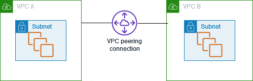

# AWS 공인 클라우드 전문가 CLF-C01 연습문제

#### 1. 다음 중 AWS에서 Amazon RDS와 같은 관리형 서비스를 사용할 때의 이점은 무엇입니까?

- [x] <mark>**서비스의 기본 인스턴스 유형 및 크기를 선택하고 최적화하는 작업에서 고객의 개입을 최소화합니다.**</mark>
- [ ] EC2 인스턴스와 같은 고객 관리형 서비스보다 성능이 뛰어납니다.
- [ ] 고객 개입 없이 용량을 자동으로 확장합니다.
- [ ] 서비스의 기본 인스턴스 유형 및 크기를 선택하고 최적화하는 작업을 고객이 직접 수행 할 필요가 없습니다.

> 해설
>
> - Amazon Relational Database Service(Amazon RDS)는 AWS 클라우드에서 관계형 데이터베이스를 더 쉽게 설치, 운영 및 확장할 수 있는 웹 서비스입니다.
> - 이 서비스는 산업 표준 관계형 데이터베이스를 위한 경제적이고 크기 조절이 가능한 용량을 제공하고 공통 데이터베이스 관리 작업을 관리합니다.

> 오답
>
> - 고객이 RDS 서비스에 사용되는 기본 인스턴스를 선택하고 최적화 할 수 있습니다.
> - 고객이 기본 인스턴스 크기와 유형을 최적화하여 관리형 서비스를 확장해야 하기 때문에 잘못된 것입니다. 이러한 AWS 서비스는 기본적으로 자동으로 확장되지 않습니다.
> - EC2 인스턴스와 같은 고객 관리형 서비스보다 우수한 성능은 항상 AWS 관리형 서비스의 경우가 아니기 때문에 올바르지 않습니다.

#### 2. 다음 중 Amazon Route 53에서 제공하는 기능은 무엇입니까? (2개 선택)

- [x] <mark>**DNS 확인**</mark>
- [x] <mark>**도메인 등록**</mark>
- [ ] DDoS 보호
- [ ] 리소스 메트릭 수집
- [ ] 웹 트래픽 필터링

> 해설
>
> - Amazon Route 53는 높은 가용성과 확장성이 뛰어난 클라우드 Domain Name System (DNS) 웹 서비스입니다.
>
> > 주요 기능
> >
> > - Resolver
> > - 트래픽 흐름
> > - 지연 시간 기반 라우팅
> > - 지역 DNS
> > - Amazon VPC용 프라이빗 DNS
> > - DNS 장애 조치
> > - 상태 확인 및 모니터링
> > - 도메인 등록
> > - CloudFront Zone Apex 지원
> > - S3 Zone Apex 지원
> > - Amazon ELB 통합
> > - Management Console
> > - 가중치 기반 라운드 로빈

#### 📍 3. 회사는 정적 IP 주소를 사용하여 애플리케이션에 대한 사용자 액세스를 최적화하기 위해 AWS 글로벌 네트워크를 사용하는 서비스가 필요합니다. 다음 중 이 기준에 맞는 서비스는 무엇입니까?

- [ ] AWS Global Accelerator
- [ ] Amazon CloudFront

> 해설
>
> - AWS Global Accelerator는 로컬 또는 글로벌 사용자를 대상으로 애플리케이션의 가용성과 성능을 개선하는 서비스입니다.
> - Application Load Balancer, Network Load Balancer 또는 Amazon EC2 인스턴스와 같이 단일 또는 여러 AWS 지역에서 애플리케이션 엔드포인트에 대한 고정된 진입점 역할을 하는 정적 IP 주소를 제공합니다.

> 오답
>
> - Amazon CloudFront는 개발자 친화적 환경에서 짧은 지연 시간과 빠른 전송 속도로 데이터, 동영상, 애플리케이션 및 API를 전 세계 고객에게 안전하게 전송하는 고속 콘텐츠 전송 네트워크(CDN) 서비스입니다.

#### 📍 4. 회사는 각 사업 단위에 대해 별도의 Virtual Private Cloud (VPC)를 유지합니다.회사의 두 개의 부서가 데이터를 비공개로 공유해야 합니다. 두 VPC간에 데이터를 비공개로 공유하는 가장 최적의 방법은 무엇입니까?

- [x] <mark>**VPC Peering**</mark>
- [ ] VPC Endpoint
- [ ] Site-tosite VPN
- [ ] AWS Direct Connect

> 해설
>
> - VPC 피어링 연결은 프라이빗 IPv4 주소 또는 IPv6 주소를 사용하여 두 VPC 간에 트래픽을 라우팅할 수 있도록 하기 위한 두 VPC 사이의 네트워킹 연결입니다.
> 

> 오답
>
> - Site-to-Site VPN : AWS Site-to-Site VPN은 데이터 센터 또는 지사와 AWS 클라우드 리소스 간에 보안 연결을 생성합니다. 이 연결은 공용 인터넷을 통해 이루어집니다. Site to Site VPN은 VPC를 상호 연결하는 데 사용할 수 없습니다.
> - AWS Direct Connect : AWS Direct Connect는 원격 네트워크에서 VPC로의 전용 프라이빗 연결을 생성합니다. 이것은 개인 연결이며 공용 인터넷을 사용하지 않습니다. 이 연결을 설정하는 데 최소 한 달이 걸립니다. Direct Connect는 VPC를 상호 연결하는 데 사용할 수 없습니다.
> - VPC 엔드 포인트 : VPC 엔드 포인트를 사용하면 인터넷 게이트웨이, NAT 디바이스, VPN 연결 또는 AWS Direct Connect 연결 없이도 VPC를 AWS PrivateLink에서 제공하는 지원되는 AWS 서비스 및 VPC 엔드 포인트 서비스에 비공개로 연결할 수 있습니다. VPC 엔드 포인트를 사용하여 두 개의 VPC를 연결할 수 없습니다.

#### 5. 최소한의 노력으로 정적 웹 사이트를 호스팅하는 데 사용할 수 있는 AWS 서비스는 무엇입니까?

- [x] <mark>**S3**</mark>

#### 📍6. 회사가 온프레미스 데이터 센터에서 AWS 클라우드로 데이터와 애플리케이션을 마이그레이션 하려고 합니다. 다음 중 이 마이그레이션을 지원하기 위해 시작 시 사용할 수 있는 옵션은 무엇입니까? (2개 선택)

- [x] <mark>**AWS 파트너 네트워크(APN)를 활용하여 이 인프라 마이그레이션을 위한 맞춤형 솔루션을 구축합니다.**</mark>
- [x] <mark>**AWS Professional Service를 활용하고 AWS Landing Zone을 설정하여 인프라 마이그레이션을 가속화합니다.**</mark>
- [ ] AWS Trusted Advidor를 사용하여 인프라 마이그레이션을 자동화합니다.
- [ ] AWS 개발자 포럼에서 중재자에게 문의합니다.
- [ ] 추가 지원을 받으려면 AWS Support에 지원 티켓을 제출합니다.

> 해설
>
> - AWS Professional Services를 활용하고 AWS Landing Zone을 설정하여 인프라 마이그레이션을 가속화합니다.
> - AWS Professional Services 조직은 AWS Cloud를 사용할 때 원하는 비즈니스 결과를 실현할 수 있도록 지원하는 글로벌 전문가 팀입니다. AWS Professional Services 컨설턴트는 빠른 결과를 얻을 수 있는 전문 기술과 경험으로 팀을 보완할 수 있습니다.
> - AWS Landing Zone은 고객이 AWS 모범 사례를 기반으로 안전한 다중 계정 AWS 환경을 보다 신속하게 설정할 수 있도록 지원하는 솔루션입니다. 이 솔루션은 안전하고 확장 가능한 워크로드를 실행하기 위한 환경 설정을 자동화하는 동시에 핵심 계정 및 리소스를 생성하여 초기 보안 기준선을 구현함으로써 시간을 절약할 수 있습니다.
> - AWS Partner Network(APN)는 Amazon Web Services를 활용하여 고객을 위한 솔루션 및 서비스를 구축하는 기술 및 컨설팅 기업을 위한 글로벌 파트너 프로그램입니다. 이 회사는 APN의 전문가와 협력하여 이 인프라 마이그레이션을 위한 맞춤형 솔루션을 구축할 수 있습니다

#### 📍7. 회사가 하이브리드 클라우드 아키텍처를 갖고 있으며 EC2 인스턴스 및 온프레미스 서버에 대한 서버 로그를 중앙 집중화하려고 합니다. 다음 중 이 사용 사례에 가장 효과적인 것은 무엇입니까?

- [x] <mark>**EC2 인스턴스와 온프레미스 서버 모두에 CloudWatch Logs 사용**</mark>
- [ ] EC2 인스턴스에는 CloudTrail을 사용하고 온프레미스 서버에는 CloudWatch Logs 사용
- [ ] EC2 인스턴스에는 CloudWatch Logs 사용하고 온프레미스 서버에는 CloudTrail 사용
- [ ] AWS Lambda를 사용하여 EC2 인스턴스 및 온프레미스 서버에서 CloudWatch Logs로 로그 데이터 전송

> 해설
>
> - Amazon CloudWatch Logs를 사용하여 Amazon Elastic Compute Cloud(Amazon EC2) 인스턴스, AWS CloudTrail, Route 53 및 기타 소스에서 로그 파일을 모니터링, 저장 및 액세스할 수 있습니다.

> 오답
>
> - AWS Lambda를 사용하면 서버를 프로비저닝하거나 관리하지 않고도 코드를 실행할 수 있습니다. 사용한 컴퓨팅 시간에 대해서만 비용을 지불합니다. Lambda는 EC2 인스턴스 및 온프레미스 서버의 로그를 중앙 집중화하는 데 사용할 수 없습니다.
> - AWS CloudTrail은 AWS 계정의 거버넌스, 규정 준수, 운영 감사 및 위험 감사를 지원하는 서비스입니다. CloudTrail을 사용하면 AWS 인프라 전체에서 작업과 관련된 계정 활동을 기록하고, 지속적으로 모니터링하고, 유지할 수 있습니다. CloudTrail은 AWS Management Console, AWS SDK, 명령 줄 도구 및 기타 AWS 서비스를 통해 수행된 작업을 포함하여 AWS 계정 활동의 이벤트 기록을 제공합니다. CloudTrail은 EC2 인스턴스 또는 온프레미스 서버에 대한 서버 로그를 중앙 집중화하는 데 사용할 수 없으므로 이 두 옵션 모두 올바르지 않습니다.

#### 📍8. 다음 중 Amazon S3 리소스에 액세스하는 데 필요한 권한을 부여하는 정책은 무엇입니까?

- [x] <mark>**버킷 정책**</mark>
- [ ] 라우팅 정책
- [ ] 네트워크 액세스 정책
- [ ] 객체 정책

> 해설
>
> - 버킷 정책과 사용자 정책은 Amazon S3 리소스에 대한 권한을 부여하는 데 사용할 수 있는 두 가지 액세스 정책 옵션입니다. 둘 다 JSON 기반 액세스 정책 언어를 사용합니다. 버킷에 버킷 정책을 추가하여 다른 AWS 계정 또는 IAM 사용자에게 버킷 및 버킷의 객체에 대한 액세스 권한을 부여합니다. 사용자 정책은 IAM 사용자가 버킷 중 하나에 액세스 할 수 있도록 허용하는 정책입니다.

#### 📍9. 회사가 특정 지역의 사용자가 콘텐츠에 액세스하는 것을 차단하려고 합니다. 이 작업을 수행하는 데 사용할 수 있는 AWS 서비스는 무엇입니까? (2개 선택)

- [x] <mark>**AWS WAF**</mark>
- [x] <mark>**Route 53**</mark>
- [ ] CloudWatch
- [ ] AWS CloudTrail
- [ ] AWS Shield

> 해설
> - AWS WAF는 고객이 정의한 조건에 따라 웹 요청을 허용, 차단 또는 모니터링(계수)하는 규칙을 구성하여 공격으로부터 웹 애플리케이션을 보호하는 웹 애플리케이션 방화벽입니다.
> - Route 53 지리적 위치 라우팅 정책을 사용하여 특정 지리적 위치를 차단할 수 있습니다. 

#### 📍10. 소셜 미디어 로그인을 통해 인증 된 사용자와 인증이 필요하지 않은 게스트 사용자에게 임시 AWS 자격 증명을 제공해야 하는 경우 다음 중 어떤 것을 사용해야합니까?

- [x] <mark>**Amazon Cognito 자격 증명 풀**</mark>
- [ ] Amazon Cognito 사용자 풀
- [ ] Amazon Cognito 동기화
- [ ] AWS Single Sign-On

> 해설
> - Amazon Cognito의 두 가지 주요 구성 요소는 사용자 풀과 자격 증명 풀입니다. 
> - 자격 증명 풀을 통해 기타 AWS 서비스에 대한 사용자 액세스 권한을 부여할 수 있습니다. 

#### 11. 클라우드 컴퓨팅의 이점 중 필요에 따라 리소스를 획득하고 더 이상 필요하지 않을 때 해제하는 이점은 무엇입니까?

- [x] <mark>**탄력성**</mark>

> 해설 
> - 클라우드 컴퓨팅을 사용하면 향후 최고 수준의 비즈니스 활동을 처리하기 위해 리소스를 사전에 오버 프로비저닝할 필요가 없습니다 대신 실제로 필요한 만큼 리소스를 프로비저닝하면 됩니다. 비즈니스 요구가 변화함에 따라 이러한 리소스를 확장하거나 축소하여 용량을 즉시 늘리거나 줄일 수 있습니다.

#### 📍12. 다음 중 AWS 클라우드에서 VPC의 일부인 요소는 무엇입니까? (2개 선택)

- [x] <mark>**인터넷 게이트웨이**</mark>
- [x] <mark>**서브넷**</mark>
- [ ] AWS Storage Gateway
- [ ] Amazon API Gateway
- [ ] 버킷과 객체

> 해설
> - VPC의 핵심 개념
> > * Virtual Private Cloud(VPC) — 사용자의 AWS 계정 전용 가상 네트워크입니다.
> > * 서브넷 — VPC의 IP 주소 범위입니다.
> > * 라우팅 테이블 — 네트워크 트래픽을 전달할 위치를 결정하는 데 사용되는 라우팅이라는 규칙 집합입니다.
> > * 인터넷 게이트웨이 — VPC의 리소스와 인터넷 간의 통신을 활성화하기 위해 VPC에 연결하는 게이트웨이입니다.
> > * VPC 엔드포인트 — 인터넷 게이트웨이, NAT 디바이스, VPN 연결 또는 AWS Direct Connect 연결을 필요로 하지 않고 PrivateLink 구동 지원 AWS 서비스 및 VPC 엔드포인트 서비스에 VPC를 비공개로 연결할 수 있습니다. VPC의 인스턴스는 서비스의 리소스와 통신하는 데 퍼블릭 IP 주소를 필요로 하지 않습니다. VPC와 기타 서비스 간의 트래픽은 Amazon 네트워크를 벗어나지 않습니다

#### 📍

- [ ]
- [ ]
- [ ]
- [ ]
- [ ]
